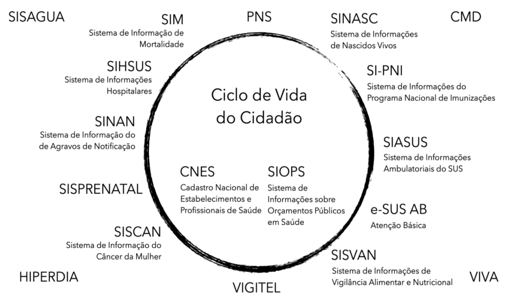

---
author:
  - Raphael de Freitas Saldanha
  - Mônica de A. F. M. Magalhães
---

# Introdução

::: {.content-visible when-format="html"}
```{=html}
<section class="podcast-player" data-transcript="podcast/introducao_dialogo_eleven_v3_transcript.json">
<h2>Podcast do capítulo</h2>
<p>Ouça a conversa e acompanhe a transcrição sincronizada. Áudio gerado por IA.</p>
<audio class="podcast-audio" controls preload="metadata">
  <source src="podcast/introducao_dialogo_eleven_v3.mp3" type="audio/mpeg">
  Seu navegador não suporta o elemento de áudio.
</audio>
<details class="podcast-transcript-wrap">
<summary>Acompanhar transcrição</summary>
<div class="podcast-transcript" aria-live="polite"></div>
</details>
<noscript>
Para acompanhar a transcrição, acesse o roteiro em
<a href="podcast/introducao.md">podcast/introducao.md</a>.
</noscript>
<script src="podcast/sync-transcript.js"></script>
</section>
```
:::

A disponibilidade oportuna de dados confiáveis é essencial para a tomada de decisão em saúde. Sistemas de vigilância, planejamento, financiamento, regulação, assistência e avaliação dependem de registros capazes de descrever o que acontece com a população e com os serviços. Nesse contexto, os Sistemas de Informação em Saúde (SIS) são componentes centrais dos sistemas de saúde e também integram redes mais amplas de estatísticas nacionais e internacionais [@abouzahrHealthInformationSystems2005; @worldhealthorganisationFrameworkStandardsCountry2008].

::::: {.callout}
Sistemas de Informação em Saúde (SIS) podem ser entendidos como um esforço integrado para *coletar, processar, reportar e usar* informações e conhecimento de saúde para influenciar a tomada de decisão, ações programáticas e pesquisa [@lippeveldRoutineHealthInformation2001].
:::

O emprego do termo "sistema" indica um processo organizado, composto por instrumentos, pessoas, normas, tecnologias, fluxos e usos. Um SIS, portanto, não se resume a um banco de dados. Ele envolve a definição do evento a ser registrado, os formulários ou interfaces de entrada, as regras de validação, os caminhos de transmissão, as rotinas de consolidação, as formas de acesso e as práticas de análise que transformam registros em informação útil.

## Sistemas, contextos e usos

A organização dos SIS varia entre países e também ao longo do tempo. Sua implantação costuma responder a necessidades políticas, econômicas, técnicas, assistenciais e epidemiológicas específicas. Por isso, compreender o contexto de criação e evolução de cada sistema é indispensável para interpretar suas possibilidades e limitações [@worldhealthorganisationFrameworkStandardsCountry2008].

No Brasil, os SIS buscam cobrir diferentes eventos de saúde que ocorrem durante o ciclo de vida da população, bem como eventos relacionados à organização e ao funcionamento do próprio sistema de saúde. Entre esses eventos estão nascimentos, óbitos, internações, atendimentos ambulatoriais, notificações de doenças e agravos, imunizações, registros de estabelecimentos, produção assistencial e informações orçamentárias. Alguns dos principais sistemas existentes no país e suas siglas são situados ao longo do ciclo de vida na @fig-ciclo-vida-sistemas.

{#fig-ciclo-vida-sistemas}

## Dados, informação e conhecimento

Para utilizar adequadamente os SIS, é fundamental distinguir dado, informação e conhecimento. O dado é o elemento mais simples do sistema: um registro delimitado de uma ocorrência, como uma data, um código de município, uma causa de óbito, um procedimento realizado ou uma dose de vacina aplicada. Isolado, o dado descreve apenas uma parte do real.

A informação surge quando os dados são organizados, analisados e interpretados em relação a uma pergunta ou necessidade concreta. Uma contagem de óbitos por município, uma taxa de internação por faixa etária ou a proporção de casos confirmados entre notificações suspeitas já expressam algum nível de processamento e interpretação.

O conhecimento, por sua vez, depende da articulação entre informações, contexto, experiência e reflexão. É a partir dele que se formulam explicações, hipóteses, prioridades de ação, avaliações de desempenho e decisões de gestão [@rouquayrol2018; @siqueira2005].

Assim, os Sistemas de Informação em Saúde podem ser entendidos como mecanismos de coleta, processamento, análise e transmissão da informação necessária para planejar, organizar, operar e avaliar os serviços de saúde [@who2000]. Sua utilidade depende tanto da qualidade dos registros quanto da capacidade de interpretar esses registros de acordo com a pergunta em análise.

## Escopo do livro

O objetivo deste livro é apresentar estes SIS com informações atualizadas sobre sua história, características dos dados e sua utilização, visando um melhor aproveitamento de seu potencial para a saúde pública brasileira.

Ao longo dos capítulos, cada sistema é tratado a partir de sua trajetória institucional, cobertura, unidade de análise, estrutura dos dados, formas de disseminação, usos frequentes e cuidados de interpretação. A intenção é apoiar uma leitura crítica dos dados em saúde, evitando tanto a subutilização das bases disponíveis quanto interpretações que desconsiderem seus processos de produção.


<!-- BEGIN GENERATED SEE ALSO -->
::: {.content-hidden when-format="typst"}
## Veja também {#sec-veja-tambem-introducao}

- [Breve histórico da experiência brasileira — seção “Sistemas nacionais e construção do SUS”](historico.html#sistemas-nacionais-e-construção-do-sus). Na edição impressa, p. 17.

- [Organização dos SIS — seção “Critérios de organização”](organizacao.html#critérios-de-organização). Na edição impressa, p. 25.

- [Eventos de saúde — seção “Do problema de saúde ao evento registrado”](eventos.html#do-problema-de-saúde-ao-evento-registrado). Na edição impressa, p. 44.

:::
<!-- END GENERATED SEE ALSO -->
