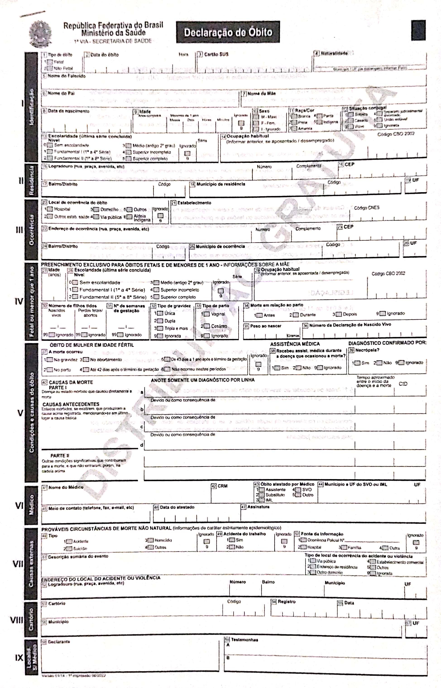

# SIM -- Sistema de Informação sobre Mortalidade {#sec-sim}

::: {.content-visible when-format="html"}
```{=html}
<section class="podcast-player" data-transcript="podcast/sim_transcript.json?v=20260712-elevenv3">
<h2>Podcast do capítulo</h2>
<p>Ouça a conversa e acompanhe a transcrição sincronizada. Áudio gerado por IA.</p>
<audio class="podcast-audio" controls preload="metadata">
  <source src="podcast/sim.mp3?v=20260712-elevenv3" type="audio/mpeg">
  Seu navegador não suporta o elemento de áudio.
</audio>
<details class="podcast-transcript-wrap">
<summary>Acompanhar transcrição</summary>
<div class="podcast-transcript" aria-live="polite"></div>
</details>
<noscript>
Para acompanhar a transcrição, acesse o roteiro em
<a href="podcast/sim.md">podcast/sim.md</a>.
</noscript>
<script src="podcast/sync-transcript.js"></script>
</section>
```
:::

## Resumo

::: {#qua-sim-caracteristicas-gerais-do-sim}

| Característica | Descrição |
|------------------------------------|------------------------------------|
| Ano de criação | 1975 |
| Evento registrado | Óbito, incluindo óbito fetal |
| Documento básico | Declaração de Óbito (DO) |
| Unidade de análise | Declaração de Óbito |
| Cobertura | Todo o território nacional |
| Abrangência assistencial | Óbitos ocorridos nas dimensões pública, privada e suplementar |
| Disseminação | Em geral anual, com bases preliminares e consolidadas |

Características gerais do SIM

:::

O Sistema de Informação sobre Mortalidade (SIM) é a principal fonte nacional para análise dos óbitos ocorridos no Brasil. Seus dados permitem estudar níveis, tendências, desigualdades e causas de mortalidade, subsidiando vigilância, planejamento, avaliação de políticas públicas e produção de indicadores de saúde. Como o óbito é um tipo de evento de saúde, o SIM também se conecta à discussão geral sobre eventos, registros e unidades de análise apresentada em @sec-eventos.

O SIM ocupa uma posição particular entre os sistemas nacionais porque lida com um evento vital que tem significado sanitário, jurídico, demográfico e social. Seu funcionamento depende de médicos, estabelecimentos de saúde, Institutos Médico-Legais (IML), Serviços de Verificação de Óbito (SVO), cartórios, secretarias de saúde, Dsei, Ministério da Saúde e equipes de vigilância. A qualidade final da informação depende da articulação entre esses pontos do fluxo.

## Quando usar o SIM

O SIM deve ser utilizado quando a pergunta envolve óbitos, causas de morte ou indicadores derivados de mortalidade. Em muitos casos, a análise precisa combinar o SIM com outras fontes, como SINASC (@sec-sinasc), estimativas populacionais (@sec-pop), SINAN (@sec-sinan) ou SIH (@sec-sih).

Em geral, o SIM é a fonte adequada quando o desfecho de interesse é a morte. A pergunta analítica precisa definir desde o início se o objetivo é estudar a população residente, os locais onde os óbitos ocorreram, a rede assistencial que recebeu os casos, a causa básica ou o conjunto de condições mencionadas na DO. Nem toda pergunta sobre morte, porém, é respondida apenas com o SIM: mortalidade infantil exige nascidos vivos como denominador; letalidade entre casos notificados depende de bases de casos; e análises de acesso a serviços podem precisar de SIH, SIA ou CNES (ver @qua-sim-perguntas-comuns-que-podem-ser-respondidas-com-o-sim).

::: {#qua-sim-perguntas-comuns-que-podem-ser-respondidas-com-o-sim}

| Pergunta de análise | Usar SIM para | Fonte complementar comum |
|------------------------|------------------------|------------------------|
| Mortalidade por causa | Contar óbitos por causa básica | CID (@sec-cid) para agrupamentos |
| Mortalidade infantil | Identificar óbitos menores de 1 ano | SINASC para nascidos vivos |
| Mortalidade materna | Identificar óbitos maternos | Investigação e classificações específicas |
| Causas externas | Analisar acidentes e violências fatais | SIH ou SIA para eventos não fatais |
| Óbitos evitáveis | Identificar causas e grupos de idade | Listas de evitabilidade |
| Risco populacional | Contar óbitos por residência | POP para denominadores |
| Pressão sobre serviços | Contar óbitos por ocorrência | CNES/SIH para rede assistencial |

Perguntas comuns que podem ser respondidas com o SIM

:::

## Histórico e organização

O SIM foi o primeiro sistema de informação em saúde de abrangência nacional. Sua criação está associada à necessidade de padronizar o registro de óbitos e qualificar as estatísticas vitais brasileiras. Em 1975, foi formado um Grupo de Trabalho no Ministério da Saúde com o objetivo de adotar um modelo único de Declaração de Óbito (DO), com impressão centralizada, controle numérico e validade legal [@sennaSistemaInformacoesSobre2009].

::: callout-tip
Entre as décadas de 1960 e 1970 chegaram a coexistir 43 modelos diferentes de atestado de óbito no país [@sennaSistemaInformacoesSobre2009].
:::

A padronização da DO reorganizou o fluxo de informações sobre mortalidade. O documento passou a nascer no serviço de saúde ou no local responsável pelo registro do óbito, circular entre família, cartório e secretaria de saúde, e alimentar uma base nacional.

Esse fluxo aproximou o Registro Civil do setor saúde. A certidão de óbito permanece vinculada ao processo cartorial, mas a DO passou a produzir também informação epidemiológica, permitindo que os óbitos fossem analisados por idade, sexo, raça/cor, município, local de ocorrência e causa de morte.

A organização nacional do SIM também acompanhou mudanças institucionais e tecnológicas. Nos primeiros anos, a preocupação central era estabelecer um instrumento único, definir fluxos, treinar equipes e construir rotinas de crítica, codificação e tabulação. Com a expansão da informática em saúde, o processamento passou a incorporar digitação e crítica em secretarias estaduais e municipais, aumentando a capacidade de uso local da informação.

Outro eixo fundamental foi a codificação das causas de morte. O atestado médico da causa segue o modelo internacional recomendado pela Organização Mundial da Saúde, e as causas são codificadas pela Classificação Internacional de Doenças (CID). A criação do Centro Brasileiro de Classificação de Doenças, em 1976, ajudou a estruturar treinamento, tradução e aplicação das regras da CID em português.

A adoção da CID-10, em 1996, marcou uma mudança relevante nas séries históricas. Comparações de mortalidade por causa antes e depois da mudança de revisão da CID exigem cautela, porque categorias, agrupamentos e regras de codificação podem mudar. Mesmo quando a pergunta parece simples, como "a mortalidade por determinada causa aumentou?", a resposta depende da continuidade das definições usadas na seleção e na tabulação da causa.

No plano normativo, a Portaria SVS/MS n. 116/2009 regulamentou a coleta de dados, o fluxo e a periodicidade de envio das informações sobre óbitos e nascidos vivos para os sistemas sob gestão da Secretaria de Vigilância em Saúde [@brasil_svs_2009_portaria116]. Essa regulamentação reforça que a DO é o documento padrão de uso obrigatório em todo o território nacional para a coleta dos dados sobre óbitos e também o documento hábil para a lavratura da certidão de óbito.

## Fluxo da Declaração de Óbito

O documento básico do SIM é a Declaração de Óbito (DO), padronizada nacionalmente, gerenciada e distribuída pelo Ministério da Saúde. A DO é emitida em três vias, com destinações distintas.

A DO tem dupla função. Do ponto de vista jurídico, permite a lavratura da Certidão de Óbito pelo Cartório de Registro Civil. Do ponto de vista epidemiológico, coleta as informações que alimentam o SIM e permitem produzir estatísticas de mortalidade. A **Declaração de Óbito** é o formulário oficial; o **atestado médico de óbito** é a parte da DO em que o médico registra as causas de morte; e a **Certidão de Óbito** é o documento jurídico emitido pelo cartório.

A versão atual da DO é organizada em nove blocos. Eles cobrem identificação, residência, ocorrência, informações específicas para óbito fetal ou menor de um ano, condições e causas do óbito, dados do médico, causas externas, cartório e localidade sem médico [@brasil_ms_2022_do_manual]. Na análise dos microdados, esses blocos aparecem como variáveis que descrevem dimensões diferentes do evento. Por isso, conhecer a estrutura do formulário ajuda a evitar erros de leitura da base (ver @qua-sim-blocos-da-declaracao-de-obito-e-usos-analiticos).

::: {#qua-sim-blocos-da-declaracao-de-obito-e-usos-analiticos}

| Bloco da DO | Conteúdo principal | Uso analítico |
|------------------------|------------------------|------------------------|
| Identificação | Dados da pessoa falecida | Deduplicação, consistência e caracterização |
| Residência | Município e endereço habitual | Indicadores da população residente |
| Ocorrência | Local e município do óbito | Rede assistencial e distribuição espacial do evento |
| Fetal ou menor de 1 ano | Informações maternas, gestacionais e do nascimento | Mortalidade fetal, neonatal e infantil |
| Condições e causas | Atestado médico, causa básica e causas associadas | Mortalidade por causa e causas múltiplas |
| Médico | Identificação do profissional responsável | Contato para esclarecimento e responsabilização |
| Causas externas | Circunstância, fonte e relação com trabalho | Acidentes, violências e mortes suspeitas |
| Cartório | Dados do registro civil | Vinculação com o fluxo jurídico |
| Localidade sem médico | Testemunhas em situações específicas | Registro em áreas sem disponibilidade médica |

Blocos da Declaração de Óbito e usos analíticos

:::

```{mermaid}
%%| fig-cap: "Fluxo de emissão e destinação das vias da Declaração de Óbito"
%%| label: fig-sim-do
flowchart TD
  do[Declaracao de Obito] --> via1[1a via]
  do --> via2[2a via]
  do --> via3[3a via]

  via1 --> sms[Secretaria Municipal de Saude]
  sms --> sim[SIM]

  via2 --> fam[Familia]
  fam --> rg[Registro Civil]
  rg --> cert[Certidao de Obito]

  via3 --> es[Estabelecimento ou unidade notificadora]
```

A primeira via é encaminhada à secretaria municipal de saúde para processamento e alimentação do SIM. A segunda via é entregue à família para apresentação ao Registro Civil. A terceira via permanece arquivada no estabelecimento de saúde ou na unidade notificadora.

O controle da numeração da DO é parte do controle do próprio sistema. Os formulários possuem sequência numérica única e são distribuídos pelo Ministério da Saúde às secretarias estaduais, que repassam às secretarias municipais, aos Dsei e às unidades notificadoras. A numeração reduz a possibilidade de duplicidade, extravio e fraude, além de permitir acompanhar a utilização dos formulários. Segundo o manual de preenchimento, podem receber formulários de DO estabelecimentos e serviços de saúde, IML, SVO, médicos cadastrados pela secretaria municipal de saúde e cartórios apenas em localidades sem médico [@brasil_ms_2022_do_manual].

::: callout-warning
Empresas funerárias não são unidades notificadoras aptas a receber formulários de DO. O fluxo da DO deve preservar a responsabilidade médica, sanitária e cartorial sobre o documento.
:::

## Modelo da Declaração de Óbito

{#modelo-do fig-alt="Modelo de Declaração de Óbito" width="90%"}

Mais informações sobre o preenchimento estão disponíveis no [manual de preenchimento da Declaração de Óbito](assets/sim/declaracao-obito-manual-instrucoes-preenchimento.pdf), disponibilizado pelo Ministério da Saúde.

## Emissão da Declaração de Óbito

O preenchimento da DO é um ato médico, com responsabilidade ética e jurídica do profissional que constata e atesta o óbito. Essa responsabilidade inclui revisar as informações, evitar abreviações ou termos vagos e registrar uma sequência causal coerente. A DO não deve ser assinada em branco, nem preenchida sem que o óbito tenha sido verificado pessoalmente, exceto nas situações previstas pelas normas profissionais e sanitárias [@brasil_ms_2022_do_manual].

A regra prática varia conforme o tipo de morte e o contexto de assistência. Em óbitos por causa natural com assistência médica, a DO deve ser emitida, sempre que possível, pelo médico que acompanhava a pessoa. Em pacientes internados, pode ser emitida pelo médico assistente, substituto ou plantonista da instituição. Em acompanhamento ambulatorial ou domiciliar, a emissão pode caber ao médico vinculado ao serviço ou programa que prestava assistência, desde que haja elementos clínicos suficientes para declarar a causa.

Quando o óbito é por causa natural e ocorre sem assistência médica, o fluxo depende da existência de Serviço de Verificação de Óbito. Onde houver SVO, o corpo deve ser encaminhado para verificação. Onde não houver SVO, a DO pode ser emitida por médico do serviço público mais próximo ou, na ausência deste, por qualquer médico da localidade, conforme as regras aplicáveis. Nesses casos, a qualidade da causa registrada tende a ser mais limitada, e a investigação posterior pode ser importante para reduzir causas mal definidas.

Óbitos por causas externas seguem outra lógica. Acidentes, agressões, suicídios, mortes suspeitas e outros eventos violentos devem ser encaminhados ao Instituto Médico-Legal quando houver esse serviço. O ponto central é que a causa básica não é apenas a lesão terminal, mas a circunstância do acidente ou violência que produziu a lesão fatal. Se uma pessoa sofre uma queda, é internada, passa por cirurgia e morre dias depois por complicações, a cadeia causal continua ligada à queda. O tempo entre o evento externo e a morte não elimina a natureza externa do óbito.

Há regras específicas para óbitos fetais e recém-nascidos. No Brasil, orienta-se a emissão da DO para óbito fetal quando a gestação tiver duração igual ou superior a 20 semanas, ou o feto tiver peso igual ou superior a 500 gramas, ou estatura igual ou superior a 25 centímetros. Se houve qualquer sinal de vida após a expulsão ou extração do corpo da mãe, trata-se de nascido vivo; se a criança morrer em seguida, deve haver Declaração de Nascido Vivo e Declaração de Óbito. Essa distinção é essencial para indicadores de mortalidade fetal, perinatal, neonatal e infantil.

O Ministério da Saúde também prevê a Declaração de Óbito epidemiológica para situações em que a morte não foi atestada por médico e, sem esse instrumento, ficaria fora das estatísticas oficiais. Essa DO tem interesse para a gestão do SIM, mas não tem caráter jurídico e não serve para lavratura da Certidão de Óbito em cartório [@brasil_ms_2022_do_manual]. Seu uso deve ser interpretado como estratégia de qualificação da cobertura estatística, não como substituição do fluxo civil da DO oficial.

## Vigilância e investigação de óbitos

O SIM não termina na digitação da DO. Em várias situações, os registros podem ser investigados para esclarecer causa, circunstância, trajetória assistencial ou informações incompletas. Essa investigação é especialmente importante em óbitos maternos, óbitos de mulheres em idade fértil, óbitos infantis, fetais e causas mal definidas. Ela transforma o SIM em instrumento de vigilância, não apenas em repositório de declarações.

Na mortalidade materna, a investigação busca identificar mortes declaradas, não declaradas, presumíveis ou mascaradas. Um óbito pode chegar ao SIM sem menção explícita de gravidez, parto ou puerpério, mas a investigação de prontuários, entrevistas e outros registros pode revelar relação com o ciclo gravídico-puerperal. Por isso, os campos sobre gravidez, parto, puerpério e morte de mulher em idade fértil são estratégicos. Eles ajudam a selecionar registros para investigação e a qualificar a razão de mortalidade materna.

Nos óbitos infantis e fetais, a investigação permite qualificar idade ao morrer, peso ao nascer, idade gestacional, tipo de gravidez, tipo de parto, condições maternas e circunstâncias assistenciais. Esses elementos são fundamentais para distinguir mortalidade fetal, neonatal precoce, neonatal tardia e pós-neonatal. Também ajudam a discutir evitabilidade, acesso ao pré-natal, atenção ao parto, cuidado neonatal e continuidade da atenção.

As fontes de investigação variam conforme o caso. Podem incluir prontuários hospitalares, fichas ambulatoriais, entrevistas domiciliares, laudos do SVO, laudos do IML, comitês de mortalidade, dados do SINASC, notificações do SINAN e outros bancos de dados. O objetivo não é apenas completar campos vazios, mas melhorar a validade da causa básica, recuperar informações relevantes e registrar alterações decorrentes da investigação.

A investigação pode alterar a causa básica originalmente informada, acrescentar causas não registradas, corrigir inconsistências e melhorar campos complementares. Quando isso ocorre, a base consolidada pode diferir da base preliminar. Para análises de séries recentes, esse ponto é decisivo: uma diferença entre dois arquivos de anos distintos pode refletir tanto mudança real no padrão de mortalidade quanto mudança no estágio de investigação e consolidação dos registros.

## Cobertura e unidade de análise

O SIM busca registrar todos os óbitos ocorridos no território nacional, independentemente do local de ocorrência ou da natureza pública, privada ou suplementar do atendimento. Também registra óbitos fetais.

A unidade de análise é a Declaração de Óbito. Isso significa que cada registro corresponde a um óbito, não a uma pessoa acompanhada longitudinalmente. Para análises populacionais, os óbitos geralmente são agregados por período, município, faixa etária, sexo, raça/cor e causa.

A cobertura do SIM melhorou ao longo do tempo, mas não deve ser tratada como homogênea em todos os lugares e períodos. Diferenças territoriais podem refletir risco real, mas também qualidade de captação, oportunidade de registro, proporção de causas mal definidas ou capacidade local de investigação (ver @qua-sim-dimensoes-importantes-para-analise-do-sim).

::: {#qua-sim-dimensoes-importantes-para-analise-do-sim}

| Dimensão | Cuidado de interpretação |
|------------------------------------|------------------------------------|
| Residência | Usada para estimar riscos da população residente |
| Ocorrência | Indica onde o óbito aconteceu |
| Causa básica | Usada para estatísticas padronizadas de mortalidade por causa |
| Causas associadas | Ajudam a compreender condições que contribuíram para a morte |
| Óbito fetal | Deve ser analisado separadamente de óbitos não fetais |

Dimensões importantes para análise do SIM

:::

Também é necessário decidir se o estudo usará óbitos totais, óbitos de residentes, óbitos ocorridos no território, óbitos não fetais ou subconjuntos específicos, como infantis, maternos ou por causas externas. Essa decisão deve aparecer no numerador do indicador e na descrição metodológica.

## Causa básica do óbito

A causa básica do óbito é a doença, agravo ou circunstância que **iniciou** a cadeia de eventos que levou diretamente à morte. No caso de causas externas, corresponde às circunstâncias do acidente ou violência que produziram a lesão fatal. Essa definição é referência internacional para padronizar estatísticas de mortalidade por causa [@who_cause_of_death_page].

Na Declaração de Óbito, a Parte I registra a sequência causal, da causa terminal às causas antecedentes. A causa básica deve aparecer na última linha preenchida dessa sequência. A Parte II é destinada a outras condições significativas que contribuíram para o óbito, mas que não fazem parte da cadeia causal principal [@brasil_ms_2022_do_manual].

::: callout-warning
Não se deve interpretar automaticamente a causa terminal como causa básica. Termos como "parada cardiorrespiratória" ou "falência múltipla de órgãos" descrevem mecanismos finais de morte, mas raramente explicam o processo que iniciou a cadeia causal.
:::

A correta definição da causa básica é um dos pontos mais importantes para a qualidade do SIM. Ela depende do preenchimento adequado da DO, da investigação quando necessária e da codificação segundo a Classificação Internacional de Doenças (CID).

O raciocínio por causa básica exige reconstruir uma cadeia, não apenas escolher a doença mais grave ou a última condição observada. Em causas externas, por exemplo, a lesão pode aparecer como causa direta, mas a circunstância do acidente ou violência é o ponto que define a causa básica. Esse detalhe é fundamental para políticas públicas, porque prevenir quedas, agressões, acidentes de trânsito ou suicídios exige reconhecer a circunstância, não apenas a lesão terminal.

## Causa básica e causas múltiplas

A análise de mortalidade costuma priorizar a causa básica, porque ela permite atribuir cada óbito a uma causa principal e construir estatísticas comparáveis. No entanto, a Declaração de Óbito também registra outras condições que fizeram parte da cadeia causal ou contribuíram para o óbito. Essas informações permitem análises por causas múltiplas (ver @qua-sim-diferencas-entre-causa-basica-e-causas-multiplas).

::: {#qua-sim-diferencas-entre-causa-basica-e-causas-multiplas}

| Tipo de causa | O que representa | Uso típico |
|------------------------|------------------------|------------------------|
| Causa básica | Evento que iniciou a cadeia que levou à morte | Estatísticas oficiais por causa |
| Causas consequenciais | Condições intermediárias ou terminais da cadeia causal | Compreender a sequência do óbito |
| Causas contribuintes | Condições relevantes fora da cadeia principal | Analisar multimorbidade e fatores associados |

Diferenças entre causa básica e causas múltiplas

:::

Análises por causas múltiplas são úteis quando uma condição contribui para muitos óbitos, mas raramente aparece como causa básica. Ainda assim, exigem mais cuidado metodológico, pois um único óbito pode mencionar várias causas.

Doenças crônicas, multimorbidade e condições associadas ao envelhecimento tornam essa distinção cada vez mais relevante. Se a pergunta for "qual é a mortalidade por causa básica cardiovascular?", a tabulação tradicional é suficiente. Se a pergunta for "em quantos óbitos o diabetes esteve presente?", será necessário usar causas múltiplas e aceitar que os totais por causa não serão mutuamente exclusivos.

## Codificação pela CID

As causas de morte são codificadas segundo a Classificação Internacional de Doenças (CID), apresentada no apêndice sobre a CID (@sec-cid). Em séries históricas, é importante observar mudanças de revisão da classificação, regras de codificação e agrupamentos utilizados.

Na prática, as análises podem usar diferentes níveis de detalhe: (ver @qua-sim-niveis-comuns-de-analise-da-causa-de-morte).

::: {#qua-sim-niveis-comuns-de-analise-da-causa-de-morte}

| Nível de análise | Exemplo | Uso |
|------------------------|------------------------|------------------------|
| Capítulo da CID | Doenças do aparelho circulatório | Grandes grupos de causas |
| Código de três caracteres | I21 | Causa específica com menor detalhamento |
| Código de quatro caracteres | I21.0 | Subcategoria mais detalhada |
| Lista ou agrupamento | Causas evitáveis, causas externas, neoplasias | Indicadores e políticas específicas |

Níveis comuns de análise da causa de morte

:::

O nível escolhido deve ser compatível com a pergunta, o tamanho da população analisada e a qualidade do preenchimento. Quanto maior o detalhamento, maior a chance de instabilidade em municípios pequenos ou períodos curtos.

Agrupamentos definidos previamente ajudam a reduzir instabilidade e aumentar interpretabilidade. Para causas externas, pode ser mais útil trabalhar com grupos como acidentes de transporte, quedas, agressões, lesões autoprovocadas e eventos de intenção indeterminada do que apresentar dezenas de códigos isolados.

## Análise territorial

O SIM permite analisar óbitos por município de residência e por município de ocorrência. Esses campos respondem a perguntas diferentes (ver @qua-sim-uso-de-residencia-e-ocorrencia-na-analise-de-mortalidade).

::: {#qua-sim-uso-de-residencia-e-ocorrencia-na-analise-de-mortalidade}

| Campo territorial | Pergunta respondida | Exemplo |
|------------------------|------------------------|------------------------|
| Residência | Onde vivia a pessoa que morreu? | Taxas de mortalidade da população residente |
| Ocorrência | Onde o óbito aconteceu? | Demanda sobre serviços e locais de ocorrência |

Uso de residência e ocorrência na análise de mortalidade

:::

Para estimar risco populacional, em geral utiliza-se o município de residência. Para estudar rede assistencial, fluxo de pacientes ou óbitos ocorridos em serviços de referência, o município de ocorrência pode ser mais adequado.

Essa diferença ganha importância em municípios-polo e capitais. Um município pode ter muitos óbitos por ocorrência porque recebe pacientes de uma região inteira, sem que seus residentes tenham maior risco de morrer. A escolha entre residência e ocorrência deve seguir a pergunta analítica, não apenas a disposição dos dados.

## Análise temporal

A análise temporal deve distinguir a data do óbito, o ano de referência do arquivo e o momento de disseminação dos dados. Óbitos de anos recentes podem estar em bases preliminares, sujeitas a revisão posterior (ver @qua-sim-elementos-temporais-importantes-no-sim).

::: {#qua-sim-elementos-temporais-importantes-no-sim}

| Elemento temporal   | Interpretação                                         |
|------------------------------------|------------------------------------|
| Data do óbito       | Momento em que o evento ocorreu                       |
| Ano do arquivo      | Recorte usado na disseminação dos microdados          |
| Data de atualização | Momento em que a base foi disponibilizada ou revisada |
| Base preliminar     | Mais oportuna, porém sujeita a alterações             |
| Base consolidada    | Mais estável, porém geralmente mais defasada          |

Elementos temporais importantes no SIM

:::

Ao comparar anos, especialmente anos recentes, verifique se as bases têm o mesmo grau de consolidação. Diferenças entre bases preliminares e consolidadas podem afetar totais, causas e campos complementares.

A data do óbito deve ser priorizada quando o objetivo é estudar a ocorrência temporal do evento. Datas de cadastro, recebimento ou atualização ajudam a avaliar oportunidade, mas não substituem a data em que a morte ocorreu.

## Checklist antes da análise

Antes de tabular o SIM, defina a unidade de análise, o recorte do numerador e as dimensões de qualidade que serão avaliadas. Esse checklist evita misturar perguntas diferentes no mesmo indicador (ver @qua-sim-decisoes-minimas-antes-de-analisar-dados-do-sim).

::: {#qua-sim-decisoes-minimas-antes-de-analisar-dados-do-sim}

| Decisão | Pergunta prática |
|------------------------------------|------------------------------------|
| Residência ou ocorrência | O indicador mede risco da população residente ou local do evento? |
| Óbito fetal ou não fetal | Óbitos fetais devem entrar, sair ou formar análise separada? |
| Causa básica ou causas múltiplas | A pergunta exige uma causa principal ou todas as condições mencionadas? |
| Base preliminar ou consolidada | A prioridade é oportunidade ou estabilidade da informação? |
| Denominador | O indicador usa população, nascidos vivos, casos notificados ou total de óbitos? |
| Agrupamento CID | O nível de detalhe é compatível com a pergunta e com o tamanho da população? |
| Qualidade mínima | Quais campos precisam ter completitude e consistência aceitáveis? |

Decisões mínimas antes de analisar dados do SIM

:::

## Exemplo: acidentes de trânsito

Acidentes de trânsito são um exemplo de uso do SIM para análise de causas externas. Nesse caso, a pergunta pode envolver quantas pessoas morreram, onde viviam, onde o óbito ocorreu, qual foi o tipo de acidente e qual grupo populacional foi mais afetado.

Uma análise adequada começa pela definição do agrupamento de CID. É preciso decidir se serão incluídos todos os acidentes de transporte ou apenas acidentes de trânsito terrestre; se pedestres, motociclistas, ocupantes de automóvel e ciclistas serão analisados juntos ou separadamente; e como serão tratados códigos inespecíficos. Essa decisão altera o numerador e deve ser documentada antes da tabulação (ver @qua-sim-campos-uteis-em-uma-analise-de-mortalidade-por-acidentes-de-transito).

::: {#qua-sim-campos-uteis-em-uma-analise-de-mortalidade-por-acidentes-de-transito}

| Elemento da análise | Campo ou dimensão | Cuidado |
|------------------------|------------------------|------------------------|
| Causa básica | Código CID de acidente de transporte | Definir agrupamento antes da análise |
| Residência | Município de residência | Usar para taxas populacionais |
| Ocorrência | Município/local de ocorrência | Usar para análise do local do óbito |
| Idade e sexo | Perfil demográfico | Estratificar para identificar grupos de risco |
| Raça/cor e escolaridade | Desigualdades sociais | Verificar completitude |
| Circunstância | Campos de causas externas | Avaliar tipo de violência, fonte e acidente de trabalho |
| Data | Data do óbito | Separar tendência real de atraso de registro |
| Tipo de óbito | Fetal/não fetal | Excluir óbitos fetais quando não pertinentes |

Campos úteis em uma análise de mortalidade por acidentes de trânsito

:::

Uma análise completa pode combinar o SIM com o SIH (@sec-sih), para observar internações por lesões de trânsito, e com estimativas populacionais (@sec-pop), para calcular taxas. Se o objetivo for mortalidade por local de residência, use óbitos de residentes. Se o objetivo for identificar locais com maior ocorrência de óbitos, use município de ocorrência.

Também é possível combinar o SIM com dados de frota, malha viária, fiscalização, atendimento pré-hospitalar ou internações, mas cada combinação responde a uma pergunta diferente. O SIM mede o evento fatal; por isso, uma taxa de mortalidade não deve ser interpretada como indicador direto de incidência de acidentes.

## Exemplo: mortalidade infantil

A mortalidade infantil ilustra bem a necessidade de integrar SIM e SINASC. O numerador é formado por óbitos de menores de um ano registrados no SIM. O denominador, em geral, é o número de nascidos vivos registrados no SINASC no mesmo território e período. Por isso, a análise exige coerência entre residência, ano, idade ao morrer e definição do nascimento (ver @qua-sim-etapas-basicas-para-analise-de-mortalidade-infantil).

::: {#qua-sim-etapas-basicas-para-analise-de-mortalidade-infantil}

| Etapa | Fonte | Decisão necessária |
|------------------------|------------------------|------------------------|
| Identificar óbitos menores de 1 ano | SIM | Usar idade ao óbito e excluir óbitos fetais |
| Classificar componente | SIM | Separar neonatal precoce, neonatal tardio e pós-neonatal |
| Obter nascidos vivos | SINASC | Usar residência da mãe no mesmo território |
| Calcular indicador | SIM + SINASC | Compatibilizar ano e município de residência |
| Interpretar resultado | SIM + SINASC + contexto assistencial | Considerar cobertura, investigação e qualidade dos campos |

Etapas básicas para análise de mortalidade infantil

:::

Um ponto crítico é distinguir óbito fetal de óbito neonatal. Se não houve sinal de vida após o parto, o evento é óbito fetal e pertence a uma análise própria. Se houve qualquer sinal de vida e a criança morreu minutos ou horas depois, há um nascimento vivo e um óbito infantil. Essa distinção afeta diretamente o numerador da mortalidade infantil, a contagem de nascidos vivos e a interpretação da atenção pré-natal, ao parto e ao recém-nascido.

Na prática, uma análise de mortalidade infantil deve verificar idade ao óbito, peso ao nascer, idade gestacional, tipo de parto, escolaridade e idade materna, município de residência e causa básica. Esses campos podem apoiar a análise de componentes da mortalidade infantil e de desigualdades. Quando o objetivo for investigar evitabilidade, é necessário usar listas de causas evitáveis e considerar a qualidade da investigação local.

## Qualidade dos dados

A partir de 1979, o SIM passou a apresentar dados consolidados e, desde então, a qualidade de preenchimento vem sendo aprimorada. Avanços importantes ocorreram na cobertura e na completitude de variáveis, mas ainda há desafios relacionados a subregistro, causas mal definidas, campos incompletos e diferenças territoriais de qualidade [@sennaSistemaInformacoesSobre2009; @jorgeAnaliseQualidadeEstatisticas2007; @reboucasAvaliacaoQualidadeSistema2025].

Qualidade no SIM não é uma dimensão única. Uma base pode ter boa cobertura de óbitos, mas baixa qualidade de causa; pode ter causas bem codificadas, mas campos sociais incompletos; ou pode ter boa qualidade em capitais e pior desempenho em municípios pequenos. Por isso, avaliações de qualidade devem ser feitas por dimensão, variável, período e território (ver @qua-sim-problemas-frequentes-que-podem-afetar-analises-com-o-sim).

::: {#qua-sim-problemas-frequentes-que-podem-afetar-analises-com-o-sim}

| Problema | Efeito na análise |
|------------------------------------|------------------------------------|
| Subregistro de óbitos | Subestima taxas e números absolutos |
| Causas mal definidas | Reduz a capacidade de interpretar padrões de mortalidade |
| Códigos garbage | Atribuem óbitos a causas pouco úteis para políticas de prevenção |
| Incompletude de raça/cor, escolaridade ou ocupação | Limita análises de desigualdades |
| Inconsistências entre idade, sexo e causa | Indicam possíveis erros de preenchimento, codificação ou digitação |
| Duplicidade | Pode superestimar óbitos em agregações |
| Baixa oportunidade | Dificulta vigilância e monitoramento de anos recentes |
| Erros de residência ou ocorrência | Afetam análises territoriais |
| Mudanças de codificação ou investigação | Podem gerar quebras em séries históricas |

Problemas frequentes que podem afetar análises com o SIM

:::

Além de listar problemas possíveis, é útil transformar a avaliação de qualidade em indicadores simples. Eles não têm ponto de corte universal: a interpretação depende da pergunta, do território, do período e da variável analisada (ver @qua-sim-indicadores-operacionais-para-avaliar-qualidade-dos-dados-do-sim).

::: {#qua-sim-indicadores-operacionais-para-avaliar-qualidade-dos-dados-do-sim}

| Indicador de qualidade | Como interpretar |
|------------------------------------|------------------------------------|
| Proporção de causas mal definidas | Mede quanto da mortalidade por causa ficou pouco esclarecida |
| Proporção de códigos garbage | Indica causas básicas pouco úteis para prevenção ou planejamento |
| Completitude de raça/cor, escolaridade e ocupação | Define se análises de desigualdade são sustentáveis |
| Consistência entre idade, sexo e causa | Ajuda a detectar erros de preenchimento, codificação ou processamento |
| Proporção de registros investigados | Mostra o grau de qualificação posterior em grupos prioritários |
| Diferença entre base preliminar e consolidada | Indica a sensibilidade da análise ao estágio de atualização |

Indicadores operacionais para avaliar qualidade dos dados do SIM

:::

O campo ocupação, por exemplo, pode ter limitações importantes em estudos sobre doenças relacionadas ao trabalho [@cavalcanteQualidadeDosRegistros2023]. Por isso, análises mais detalhadas devem verificar completitude, consistência e mudanças históricas das variáveis utilizadas.

As causas mal definidas e os chamados códigos garbage merecem atenção especial. Eles indicam causas pouco informativas, muitas vezes relacionadas a falta de assistência médica, ausência de investigação, preenchimento inadequado ou seleção de mecanismos terminais como causa básica. Uma proporção elevada desses códigos pode esconder a magnitude real de doenças cardiovasculares, neoplasias, causas externas, doenças infecciosas ou outras causas específicas.

Campos sociais também precisam ser avaliados. Raça/cor, escolaridade e ocupação são fundamentais para estudar desigualdades, mas sua qualidade pode variar segundo período, território, tipo de óbito e circunstância de preenchimento. Em causas externas, a qualidade da circunstância é tão importante quanto a lesão, pois códigos inespecíficos dificultam distinguir acidente, agressão, lesão autoprovocada e evento de intenção indeterminada.

Essa etapa deve vir antes da análise substantiva, não apenas como anexo metodológico. Quando a qualidade varia muito entre territórios ou anos, a diferença observada no indicador pode refletir tanto uma mudança real de mortalidade quanto uma mudança na qualidade do registro.

## Linha do tempo do SIM

::: {.content-visible when-format="html"}
```{r}
#| echo: false
#| message: false
#| fig-cap: "Linha do tempo do SIM"
#| column: page
timevis::timevis(readr::read_csv2(file = "linha_tempo_sim.csv"))
```
:::

Um histórico mais aprofundado sobre a construção e evolução do SIM está disponível [neste documento](assets/sim/INTRO.pdf).

## Estrutura dos dados

O documento de [estrutura do SIM](assets/sim/Estrutura_SIM_para_CD.pdf) descreve as variáveis disponíveis nos arquivos de disseminação. Entre os campos de maior uso estão ano e data do óbito, município de residência, município de ocorrência, sexo, idade, raça/cor, escolaridade, causa básica e causas múltiplas.

Os microdados do SIM são disseminados em arquivos organizados por tipo, ano e unidade federada. Historicamente, os arquivos do DATASUS são distribuídos em formato DBC, que corresponde a arquivos DBF compactados. Em outros ambientes, especialmente no OpenDataSUS, podem estar disponíveis versões em formatos abertos, como CSV, incluindo bases preliminares de anos recentes [@opendatasus_sim]. A escolha da fonte deve considerar finalidade, atualização, formato e reprodutibilidade.

Alguns campos são diretamente preenchidos na DO, enquanto outros são calculados, derivados, recodificados ou resultam de investigação. Em estudos reprodutíveis, é recomendável registrar o dicionário usado, a data de acesso e a versão da base.

### Campos mínimos para inspecionar

Os nomes e a disponibilidade das variáveis podem variar conforme o arquivo e o período, por isso a estrutura do ano analisado deve ser conferida antes do processamento. Em análises iniciais, costuma ser útil verificar: (ver @qua-sim-campos-uteis-para-uma-primeira-inspecao-dos-dados-do-sim).

::: {#qua-sim-campos-uteis-para-uma-primeira-inspecao-dos-dados-do-sim}

| Campo | Uso |
|------------------------------------|------------------------------------|
| `DTOBITO` | Data do óbito |
| `CODMUNRES` | Município de residência |
| `CODMUNOCOR` | Município de ocorrência |
| `IDADE` | Idade no óbito |
| `SEXO` | Sexo |
| `RACACOR` | Raça/cor |
| `ESC` ou variável equivalente | Escolaridade |
| `CAUSABAS` | Causa básica do óbito |
| `CAUSABAS_O` | Causa básica antes de eventual resseleção, quando disponível |
| `LINHAA` a `LINHAD` | Causas informadas na Parte I da DO |
| `LINHAII` | Condições informadas na Parte II da DO |
| Linhas/causas da DO | Análise de causas múltiplas |
| `TIPOBITO` ou arquivo DOFET | Identificação de óbito fetal, quando aplicável |
| `CIRCOBITO` | Circunstância em óbitos por causas externas |
| `ACIDTRAB` | Indicação de acidente de trabalho |
| Campos de investigação | Avaliar qualificação posterior do registro |

Campos úteis para uma primeira inspeção dos dados do SIM

:::

A variável `IDADE` exige cuidado porque codifica unidade e quantidade em um mesmo campo. Idades em minutos, horas, dias, meses e anos não devem ser lidas como número simples sem processamento. Esse detalhe é decisivo para mortalidade neonatal e infantil. De forma semelhante, variáveis de escolaridade mudaram ao longo do tempo, e análises históricas podem precisar harmonizar categorias antigas e novas.

### Prefixo dos arquivos

::: {#qua-sim-prefixos-comuns-dos-arquivos-do-sim}

| Prefixo | Conteúdo                                  |
|---------|-------------------------------------------|
| DO      | Declarações de óbito                      |
| DOEXT   | Declarações de óbitos por causas externas |
| DOFET   | Declarações de óbitos fetais              |
| DOINF   | Declarações de óbitos infantis            |
| DOMAT   | Declarações de óbitos maternos            |
| DOREXT  | Mortalidade de residentes no exterior     |

Prefixos comuns dos arquivos do SIM

:::

O @qua-sim-prefixos-comuns-dos-arquivos-do-sim sintetiza os elementos discutidos. Os prefixos indicam subconjuntos de disseminação e podem facilitar análises temáticas, mas não substituem a checagem dos campos internos. A documentação do ano e da fonte deve ser conferida antes de combinar arquivos.

## Acesso aos dados

Os dados do SIM podem ser acessados por diferentes caminhos, a depender do objetivo da análise (ver @qua-sim-formas-de-acesso-aos-dados-do-sim).

::: {#qua-sim-formas-de-acesso-aos-dados-do-sim}

| Forma de acesso | Indicação de uso |
|------------------------------------|------------------------------------|
| TabNet | Tabulações rápidas e consultas agregadas |
| TabWin/DBC | Download e tabulação local de arquivos do DataSUS |
| R | Fluxos reprodutíveis com `{microdatasus}` |
| Python | Fluxos reprodutíveis com PySUS |
| PCDaS | Uso em ambiente de notebooks e infraestrutura de dados |
| OpenDataSUS | Arquivos em formatos abertos, incluindo bases preliminares |

Formas de acesso aos dados do SIM

:::

### TabNet

Os dados do SIM podem ser acessados no TabNet do DataSUS, na seção de Estatísticas Vitais.

-   [TabNet SIM](https://datasus.saude.gov.br/mortalidade-desde-1996-pela-cid-10)

### TabWin e transferência de arquivos

Para uso no TabWin ou em fluxos próprios de processamento, é possível baixar arquivos de dados no formato DBC e arquivos auxiliares de tabulação no serviço de transferência de arquivos do DataSUS.

-   [TabWin - Transferência de arquivos](https://datasus.saude.gov.br/transferencia-de-arquivos/)

### R

O pacote [`{microdatasus}`](https://rfsaldanha.github.io/microdatasus/index.html) permite baixar e pré-processar microdados do DataSUS em R [@Saldanha2019a].

```{r}
#| eval: false
#| message: false
library(microdatasus)

sim_raw <- fetch_datasus(
  year_start = 2021,
  year_end = 2021,
  uf = "AC",
  information_system = "SIM-DO"
)

sim_p <- process_sim(sim_raw)

sim_p
```

O exemplo abaixo ilustra uma etapa simples de análise após o processamento. A tabela `populacao` é externa ao SIM e representa a população residente do mesmo município e ano; a escolha do denominador é discutida no apêndice sobre estimativas populacionais (@sec-pop).

```{r}
#| eval: false
#| message: false
library(dplyr)

obitos_residentes <- sim_p |>
  filter(TIPOBITO != "Fetal") |>
  mutate(
    ano = as.integer(format(DTOBITO, "%Y")),
    codmun_res = CODMUNRES
  ) |>
  count(codmun_res, ano, name = "obitos")

taxa_mortalidade <- obitos_residentes |>
  left_join(populacao, by = c("codmun_res" = "codmun", "ano")) |>
  mutate(taxa_100mil = obitos / populacao * 100000)

taxa_mortalidade
```

### Python

A biblioteca PySUS também permite acessar dados do SIM em fluxos de análise em Python.

-   [PySUS SIM](https://pysus.readthedocs.io/en/latest/databases/SIM.html)

### PCDaS

Os dados do SIM estão disponíveis na Plataforma de Ciência de Dados aplicada à Saúde (PCDaS) para acesso em ambiente de notebooks.

-   [Dados SIM](https://pcdas.icict.fiocruz.br/conjunto-de-dados/sistema-de-informacoes-de-mortalidade-sim/)
-   [Dados SIM-DOFET](https://pcdas.icict.fiocruz.br/conjunto-de-dados/sistema-de-informacao-sobre-mortalidade-declaracao-de-obitos-fetais-sim-dofet/)

### OpenDataSUS

Dados em formato CSV estão sendo disponibilizados no OpenDataSUS, incluindo versões preliminares de anos recentes.

-   [OpenDataSUS - SIM](https://opendatasus.saude.gov.br/dataset/sim)

Ao usar OpenDataSUS, é importante registrar a data de download e observar se o arquivo é preliminar ou consolidado. A vantagem dos formatos abertos é facilitar uso em diferentes linguagens e ambientes; a cautela é que a atualização de bases recentes pode alterar totais, causas e campos derivados.

## Relacionamento com outros sistemas

O SIM pode ser analisado isoladamente, mas muitas perguntas exigem integração com outras bases. Essa integração pode ser feita por agregação territorial e temporal ou por relacionamento de registros, quando houver justificativa metodológica, autorização e proteção adequada dos dados (ver @qua-sim-integracoes-frequentes-entre-o-sim-e-outros-sistemas).

::: {#qua-sim-integracoes-frequentes-entre-o-sim-e-outros-sistemas}

| Pergunta | Fontes combinadas | Cuidado principal |
|------------------------|------------------------|------------------------|
| Mortalidade infantil | SIM + SINASC (@sec-sinasc) | Usar nascidos vivos como denominador |
| Óbitos entre casos notificados | SIM + SINAN (@sec-sinan) | Harmonizar datas, território e identificação |
| Óbitos após internação | SIM + SIH (@sec-sih) | Definir janela temporal e evitar duplicidade de AIH |
| Taxas populacionais | SIM + POP (@sec-pop) | Usar população residente do mesmo período |
| Eventos fatais e não fatais | SIM + sistemas assistenciais | Separar risco de morte de carga de atendimento |

Integrações frequentes entre o SIM e outros sistemas

:::

Em relacionamentos determinísticos ou probabilísticos, é necessário definir previamente quais campos serão usados, como serão tratados registros incompletos, duplicidades e discordâncias, e qual será a unidade final de análise. O resultado do relacionamento não deve ser interpretado como simples soma de bases: ele depende das regras de pareamento, da qualidade dos identificadores e da finalidade da análise.

Na integração com SINASC, a coerência entre nascimento vivo e óbito infantil é central. Na integração com SINAN ou SIH, datas e unidades de análise têm significados diferentes. Essas diferenças exigem desenho metodológico explícito: qual evento inicia a coorte, qual janela temporal será usada, como serão tratados múltiplos registros e qual será o desfecho.

## Principais usos e indicadores

Segundo @OPAS2008, os dados do SIM são utilizados na construção de diversos indicadores de mortalidade. A ficha de cada indicador deve explicitar numerador, denominador, recorte territorial, período, idade, causa e critérios de exclusão (ver @qua-sim-exemplos-de-indicadores-construidos-com-dados-do-sim).

::: {#qua-sim-exemplos-de-indicadores-construidos-com-dados-do-sim}

| Indicador | Numerador principal | Denominador ou cuidado |
|------------------------|------------------------|------------------------|
| Taxa de mortalidade infantil | Óbitos menores de 1 ano | Nascidos vivos do SINASC |
| Mortalidade neonatal e pós-neonatal | Óbitos infantis por idade | Classificar corretamente a idade no óbito |
| Mortalidade em menores de cinco anos | Óbitos menores de 5 anos | População ou nascidos vivos, conforme definição |
| Razão de mortalidade materna | Óbitos maternos | Nascidos vivos e investigação do óbito |
| Mortalidade proporcional por causa | Óbitos por grupo de causas | Total de óbitos no mesmo recorte |
| Taxa por causas externas | Óbitos por causa externa | População residente e agrupamento CID |

Exemplos de indicadores construídos com dados do SIM

:::

Consulte o [livro da RIPSA](http://tabnet.datasus.gov.br/tabdata/livroidb/2ed/indicadores.pdf) para mais detalhes sobre esses e outros indicadores.

## Cuidados de interpretação

Ao utilizar o SIM, alguns cuidados são recorrentes:

-   distinguir óbitos por residência e por ocorrência;
-   separar óbitos fetais, infantis, maternos e por causas externas quando necessário;
-   verificar se a base é preliminar ou consolidada;
-   avaliar causas mal definidas e campos incompletos;
-   não interpretar mecanismo terminal de morte como causa básica;
-   observar mudanças na CID, nos formulários, na investigação e nas regras de codificação;
-   considerar a qualidade diferencial por região, município, período e variável.

::: callout-warning
Erros comuns incluem calcular taxas com óbitos por ocorrência e população residente, misturar bases preliminares e consolidadas na mesma série, incluir óbitos fetais em indicadores de mortalidade geral, tratar causas mal definidas como grupo substantivo de causa e usar códigos CID muito detalhados em populações pequenas sem avaliar instabilidade.
:::

## Bibliografia recomendada

### Documentos auxiliares

-   [Histórico do SIM](assets/sim/INTRO.pdf)
-   [Estrutura do SIM](assets/sim/Estrutura_SIM_para_CD.pdf)
-   [Manual de preenchimento da Declaração de Óbito](assets/sim/declaracao-obito-manual-instrucoes-preenchimento.pdf)
-   [A Declaração de Óbito: documento necessário e importante](assets/sim/a-declaracao-de-obito-documento-necessario-e-importante.pdf)

### Vídeos





### Avaliação da qualidade dos dados

-   Artigo *Qualidade dos registros de ocupação das doenças associadas ao asbesto no sistema de informação sobre mortalidade, Brasil* [@cavalcanteQualidadeDosRegistros2023]. Disponível [aqui](https://doi.org/10.1590/1414-462X202331040547).
-   Artigo *Análise da qualidade das estatísticas vitais brasileiras: a experiência de implantação do SIM e do SINASC* [@jorgeAnaliseQualidadeEstatisticas2007]. Disponível [aqui](https://doi.org/10.1590/S1413-81232007000300014).
-   Artigo *Avaliação da qualidade do Sistema Brasileiro de Informações sobre Mortalidade (SIM): uma scoping review* [@reboucasAvaliacaoQualidadeSistema2025]. Disponível [aqui](https://doi.org/10.1590/1413-81232025301.08462023).


<!-- BEGIN GENERATED SEE ALSO -->
::: {.content-hidden when-format="typst"}
## Veja também {#sec-veja-tambem-sim}

- [Eventos de saúde — seção “Óbitos”](eventos.html#óbitos). Na edição impressa, p. 51.

- [CID — Classificação Internacional de Doenças — seção “Mortalidade e morbidade”](cid.html#mortalidade-e-morbidade). Na edição impressa, p. 369.

- [SINASC — Sistema de Informação sobre Nascidos Vivos — seção “Uso como denominador”](sinasc.html#uso-como-denominador). Na edição impressa, p. 95.

:::
<!-- END GENERATED SEE ALSO -->
