# SINAN -- Sistema de Informação de Agravos de Notificação {#sec-sinan}

::: {.content-visible when-format="html"}
```{=html}
<section class="podcast-player" data-transcript="podcast/sinan_transcript.json">
<h2>Podcast do capítulo</h2>
<p>Ouça a conversa e acompanhe a transcrição sincronizada. Áudio gerado por IA.</p>
<audio class="podcast-audio" controls preload="metadata">
  <source src="podcast/sinan.mp3" type="audio/mpeg">
  Seu navegador não suporta o elemento de áudio.
</audio>
<details class="podcast-transcript-wrap">
<summary>Acompanhar transcrição</summary>
<div class="podcast-transcript" aria-live="polite"></div>
</details>
<noscript>
Para acompanhar a transcrição, acesse o roteiro em
<a href="podcast/sinan.md">podcast/sinan.md</a>.
</noscript>
<script src="podcast/sync-transcript.js"></script>
</section>
```
:::

## Resumo

| Característica | Descrição |
|---|---|
| Ano de criação | 1993 |
| Evento registrado | Suspeita, confirmação, investigação ou acompanhamento de doença, agravo ou evento de saúde pública |
| Documento básico | Ficha de notificação e, quando aplicável, ficha de investigação ou acompanhamento |
| Unidade de análise | Notificação, caso, investigação ou episódio, conforme o agravo |
| Cobertura | Serviços públicos e privados, conforme a lista de notificação compulsória |
| Abrangência | Lista nacional, com possibilidade de inclusão de agravos de interesse estadual ou municipal |
| Disseminação | Mensal ou por bases específicas, com defasagem variável conforme agravo e forma de acesso |
: Características gerais do SINAN

O Sistema de Informação de Agravos de Notificação (SINAN) é uma das principais fontes da vigilância epidemiológica no Brasil. Ele registra doenças, agravos e eventos de saúde pública que exigem notificação, investigação, monitoramento ou resposta do sistema de saúde.

O ponto central para interpretar o SINAN é que o sistema não registra apenas casos confirmados. Em muitos agravos, a entrada ocorre a partir de uma suspeita, e a classificação final pode ser confirmada, descartada, inconclusiva ou ainda estar em investigação. Por isso, qualquer análise deve declarar se está contando notificações, casos confirmados, casos prováveis, casos descartados ou registros em acompanhamento.

## Quando usar o SINAN

O SINAN deve ser usado quando a pergunta envolve doenças e agravos de notificação compulsória, vigilância epidemiológica, surtos, investigação de casos, confirmação/descarte, encerramento, oportunidade da notificação ou perfil de casos notificados.

| Pergunta de análise | Usar SINAN para | Fonte complementar comum |
|---|---|---|
| Quantos casos foram notificados? | Contar notificações | População (@sec-pop) para taxas |
| Quantos casos foram confirmados? | Filtrar classificação final | Definição de caso vigente |
| Onde ocorreu a provável infecção? | Analisar local provável de infecção | Dados ambientais, vetoriais ou territoriais |
| Onde mora a pessoa notificada? | Analisar município de residência | População residente |
| O caso evoluiu para óbito? | Analisar evolução/desfecho | SIM (@sec-sim) para mortalidade |
| O caso foi internado? | Analisar gravidade ou vínculo com internação | SIH (@sec-sih) |
| Houve atraso de notificação? | Comparar datas de sintomas, notificação e digitação | Rotinas locais de vigilância |
: Perguntas comuns que podem ser respondidas com o SINAN

## Histórico e organização

O SINAN é responsável por coletar, transmitir e disseminar dados sobre doenças, agravos e eventos de saúde pública cuja notificação é compulsória em território nacional. A [lista nacional de notificação compulsória](https://www.gov.br/saude/pt-br/composicao/svsa/notificacao-compulsoria) é atualizada conforme mudanças no cenário epidemiológico, risco de surto ou epidemia, magnitude, gravidade, transcendência e vulnerabilidade. Em 2026, a lista foi atualizada pela [Portaria GM/MS nº 10.175, de 23 de janeiro de 2026](https://bvsms.saude.gov.br/bvs/saudelegis/gm/2026/prt10175_26_01_2026.html), incluindo anomalias congênitas.

A lista inclui doenças transmissíveis, doenças imunopreveníveis, agravos relacionados ao trabalho, acidentes por animais peçonhentos, violências, eventos adversos, óbitos de interesse da vigilância, emergências de saúde pública e outros eventos que exigem resposta oportuna.

A implantação do SINAN foi iniciada em 1993 de forma gradual. Nos primeiros anos, o sistema enfrentou problemas de fluxo, gestão e limitações do programa informatizado. A regulamentação de seu funcionamento ocorreu em 1998, tornando obrigatória a alimentação regular da base nacional por municípios, estados e Distrito Federal e contribuindo para melhoria dos dados [@caetanoSistemaInformacaoAgravos2009].

A unidade operacional do SINAN são as fichas de notificação, investigação, conclusão ou acompanhamento, que variam conforme o agravo. Um caso suspeito pode ser notificado inicialmente com informações mínimas e receber atualizações posteriores sobre investigação, exames, classificação final, evolução e encerramento. As informações subsidiam vigilância, detecção de surtos, acompanhamento de epidemias, avaliação de ações de controle e planejamento em saúde.

## Fluxo da notificação

O fluxo geral do SINAN começa na suspeita ou confirmação de um evento de notificação, passa pela unidade notificadora e pelas esferas municipal, estadual e federal, e pode incluir investigação, exames, classificação final e encerramento.

::: {.content-hidden when-format="epub"}
```{mermaid}
%%| fig-cap: "Fluxo de notificação do SINAN"
%%| label: fig-sinan-fluxo

flowchart TD
  cs[Caso suspeito ou confirmado] --> us[Unidade notificadora]
  us --> not[Notificação]
  not --> sms[Secretaria Municipal de Saúde]
  sms --> ses[Secretaria Estadual de Saúde]
  ses --> ms[Ministério da Saúde]
  not --> inv[Investigação]
  inv --> exam[Exames e critérios clínico-epidemiológicos]
  exam --> final[Classificação final]
  final --> conf[Caso confirmado]
  final --> desc[Caso descartado]
  final --> incon[Caso inconclusivo]
  conf --> enc[Encerramento ou acompanhamento]
  desc --> enc
  incon --> enc
  enc --> sms
```
:::

Esse fluxo reforça que o SINAN é uma base dinâmica. Dependendo do agravo e do momento da extração, uma base pode conter notificações recentes ainda sem encerramento, registros antigos corrigidos ou casos descartados após investigação.

## SINAN NET, SINAN Online e e-SUS SINAN

O SINAN teve diferentes versões e estratégias operacionais. O SINAN NET é a versão usada para grande parte dos agravos; o SINAN Online permanece associado a alguns fluxos, como dengue e chikungunya; e o e-SUS SINAN moderniza o registro, com formulários on-line e integração progressiva de agravos.

| Sistema ou módulo | Uso principal | Cuidado analítico |
|---|---|---|
| SINAN NET | Notificação e investigação de agravos com fichas padronizadas | Layouts e rotinas podem variar por agravo |
| SINAN Online | Registros on-line de agravos específicos | Nem todo agravo está no mesmo módulo |
| e-SUS SINAN | Modernização do registro e notificação on-line | Transição pode gerar mudanças de fluxo e estrutura |
| OpenDataSUS | Bases abertas de alguns agravos | Campos, periodicidade e atualização variam por base |
: Versões e formas de disseminação relacionadas ao SINAN

O Ministério da Saúde mantém uma página sobre o [SINAN](https://www.gov.br/saude/pt-br/composicao/svsa/sistemas-de-informacao/sinan/sinan) e uma plataforma específica do [e-SUS SINAN](https://plataforma.saude.gov.br/esussinan/).

::: {.content-visible when-format="html"}
```{r}
#| echo: false
#| message: false
#| fig-cap: "Linha do tempo do SINAN"
#| column: page
timevis::timevis(readr::read_csv2(file = "linha_tempo_sinan.csv"))
```
:::

## Estrutura dos dados

O SINAN apresenta dados para *todos os casos suspeitos notificados*, independente do diagnóstico final. Desta forma, para se obter o total de casos *confirmados* para determinada doença ou agravo, deve-se filtrar os dados segundo o diagnóstico final.

Durante epidemias, observa-se no SINAN um aumento de casos notificados, que podem ou não ser confirmados posteriormente com o acompanhamento do caso.

::: {.callout-note}
Uma possível utilidade para se manter o registro dos casos descartados é o cálculo do *Indicador de Positividade*, que avalia a proporção de casos confirmados dentre os casos notificados.

$$
pos = \frac{c_c}{c_c + c_d + c_i}
$$

Onde $c_c$ são casos confirmados, $c_d$ são casos descartados e $c_i$ são casos com diagnóstico inconclusivo.
:::

A confirmação de casos, em geral, pode ser feita por exames laboratoriais, testes rápidos, critérios clínicos, critérios epidemiológicos ou combinação desses elementos, conforme a definição de caso vigente. A confirmação clínico-epidemiológica costuma ser mais adotada em situações de surtos e epidemias, quando há limitação de exames disponíveis. Em casos suspeitos de dengue, por exemplo, um caso pode ser confirmado a partir de sintomas e vínculo epidemiológico com caso confirmado laboratorialmente.

> Na impossibilidade de realização de confirmação laboratorial específica ou em casos com resultados laboratoriais inconclusivos, deve-se considerar a confirmação por vínculo epidemiológico com um caso confirmado laboratorialmente, após avaliação da distribuição espacial e espaço-temporal dos casos confirmados.[@ministeriodasaudeGuiaVigilanciaEm2024]

## Definições de caso

As definições de caso são específicas por agravo e podem mudar ao longo do tempo. Antes de calcular incidência, letalidade, positividade ou oportunidade, verifique a definição vigente no período analisado.

| Termo | Sentido operacional | Cuidado |
|---|---|---|
| Caso suspeito | Registro que atende a critérios iniciais de suspeição | Pode ser descartado após investigação |
| Caso provável | Registro com evidência suficiente para monitoramento, mas sem confirmação plena | Definição varia por agravo |
| Caso confirmado | Registro que atende à definição de confirmação | Pode ser confirmado por critério laboratorial, clínico-epidemiológico ou outro |
| Caso descartado | Notificação investigada que não atende à definição de caso | Útil para positividade e qualidade da vigilância |
| Caso inconclusivo | Registro sem elementos suficientes para confirmar ou descartar | Pode indicar problema de investigação ou perda de seguimento |
| Critério laboratorial | Confirmação baseada em exame ou teste | Depende de oportunidade e disponibilidade de testagem |
| Critério clínico-epidemiológico | Confirmação por quadro clínico e vínculo epidemiológico | Frequente em surtos e períodos epidêmicos |
| Vínculo epidemiológico | Associação com caso, exposição, local ou período conhecido | Exige investigação territorial e temporal |
: Termos usados na classificação de casos no SINAN

::: {.callout-warning}
Não reutilize automaticamente códigos de classificação final de um agravo em outro. O significado de campos como `CLASSI_FIN`, `CRITERIO` e `EVOLUCAO` depende do dicionário específico.
:::

## Unidade de análise

A unidade de análise no SINAN depende da pergunta e do agravo. Em geral, uma linha representa uma notificação ou investigação, mas o analista pode querer contar casos confirmados, episódios, pessoas, surtos ou acompanhamentos.

| Unidade | O que representa | Quando usar | Cuidado |
|---|---|---|---|
| Notificação | Registro inicial de suspeita ou evento | Monitoramento oportuno e sensibilidade da vigilância | Inclui descartados e registros em investigação |
| Caso confirmado | Registro que atende à definição de caso | Incidência e indicadores epidemiológicos | Exige filtro de classificação final |
| Caso descartado | Notificação investigada e descartada | Qualidade da vigilância e positividade | Não deve ser somado a confirmados |
| Pessoa | Indivíduo notificado | Estudos individuais e relacionamento de bases | Pode haver duplicidade ou reinfecção |
| Episódio | Evento clínico ou epidemiológico | Agravos com reinfecção ou recorrência | Requer regra temporal |
| Acompanhamento | Seguimento de tratamento ou evolução | Tuberculose, hanseníase e agravos crônicos | Pode depender de fichas específicas |
| Surto | Evento coletivo | Investigação de surtos | Unidade não é o caso individual |
: Unidades de análise frequentes no SINAN

::: {.callout-warning}
Evite escrever "casos" quando o numerador conta notificações sem filtro de classificação final. A distinção entre caso suspeito, confirmado, descartado e em investigação é central no SINAN.
:::

## Datas e territórios

Dados de casos suspeitos reportados no SINAN podem apresentar diversas variáveis de datas e locais relativas a diferentes momentos do acompanhamento do caso. As datas mais comuns são: data de primeiros sintomas, data de provável infecção, data de notificação, data de digitação, data de exames laboratoriais, data de diagnóstico final, data de encerramento e data de evolução. Já as variáveis de localização mais comuns são: município/UF de provável infecção, município/UF de residência e município/UF de notificação.

| Recorte | Pergunta respondida | Exemplo de uso |
|---|---|---|
| Início de sintomas | Quando a doença começou? | Curva epidêmica |
| Notificação | Quando o sistema foi acionado? | Oportunidade da vigilância |
| Digitação | Quando entrou na base? | Atraso operacional |
| Encerramento | Quando a investigação foi concluída? | Qualidade do acompanhamento |
| Residência | Onde vive a pessoa notificada? | Taxa por população residente |
| Provável infecção | Onde ocorreu a exposição? | Autoctonia e investigação ambiental |
| Notificação | Onde o caso foi notificado? | Fluxo de serviços e vigilância |
: Datas e territórios usados em análises do SINAN

### Que data usar?

| Objetivo | Data preferida | Alternativa | Cuidado |
|---|---|---|---|
| Curva epidêmica | Início dos sintomas | Data provável de infecção | Pode haver ignorados ou datas inconsistentes |
| Monitoramento operacional | Notificação | Digitação | Mede entrada no sistema, não início do evento |
| Oportunidade da vigilância | Sintomas e notificação | Notificação e digitação | Definir o intervalo antes da análise |
| Encerramento | Encerramento | Classificação final | Prazos variam por agravo |
| Resultado laboratorial | Coleta ou resultado do exame | Notificação | Nem todo caso tem exame |
| Incidência territorial | Data de sintomas e residência | Provável infecção | Depende da pergunta epidemiológica |
: Escolha de datas para análises com SINAN

Para acompanhamento epidemiológico, é comum usar data de início de sintomas, semana epidemiológica ou data provável de infecção, a depender do agravo. Para taxas populacionais, use município de residência; para investigação de transmissão, use local provável de infecção; para gestão de serviços, use município ou unidade notificadora.

Casos em que o município ou UF de provável infecção é o mesmo da residência podem ser classificados como autóctones, isto é, a infecção provavelmente ocorreu no território de residência. Quando o local provável de infecção é diferente da residência, podem ser classificados como alóctones.

## Dicionário mínimo

Os campos variam conforme agravo, versão da ficha e forma de acesso, mas alguns nomes aparecem com frequência em bases do SINAN e ajudam na primeira inspeção.

| Campo comum | Uso típico | Atenção |
|---|---|---|
| `DT_NOTIFIC` | Data de notificação | Não é necessariamente início dos sintomas |
| `DT_SIN_PRI` | Data dos primeiros sintomas | Pode estar ausente em agravos sem sintomas definidos |
| `SEM_NOT` ou equivalente | Semana epidemiológica da notificação | Confirmar se deriva de notificação ou sintomas |
| `ID_MUNICIP` | Município de notificação | Pode representar serviço, não residência |
| `ID_MN_RESI` | Município de residência | Usar em taxas populacionais |
| `CLASSI_FIN` | Classificação final | Códigos variam por agravo |
| `CRITERIO` | Critério de confirmação/descarte | Laboratorial, clínico-epidemiológico ou outros |
| `EVOLUCAO` | Evolução do caso | Pode exigir relacionamento com SIM para óbitos |
| `DT_ENCERRA` | Data de encerramento | Usada para oportunidade de investigação |
| Campos laboratoriais | Coleta, resultado e método | Disponibilidade varia por agravo |
: Campos frequentes em bases do SINAN

## Qualidade dos dados

A qualidade do SINAN deve ser avaliada por agravo, período, território e variável. Mudanças de ficha, definição de caso, fluxo de notificação, disponibilidade de testes e versões do sistema podem alterar séries temporais.

| Dimensão | Pergunta de controle |
|---|---|
| Completitude | Campos essenciais estão preenchidos? |
| Consistência | Datas, idade, sexo, evolução e classificação final são compatíveis? |
| Duplicidade | Há registros repetidos da mesma pessoa ou episódio? |
| Oportunidade | Quanto tempo passou entre sintomas, notificação, digitação e encerramento? |
| Encerramento | Casos antigos permanecem sem classificação final? |
| Definição de caso | A regra vigente mudou no período? |
| Sensibilidade da vigilância | Aumento de notificações reflete transmissão, busca ativa ou mudança operacional? |
: Dimensões de qualidade importantes no SINAN

```{r}
#| eval: false
#| message: false
library(dplyr)

validacao_sinan <- sinan_p |>
  summarise(
    notificacoes = n(),
    sem_classificacao_final = sum(
      is.na(CLASSI_FIN) | CLASSI_FIN == "",
      na.rm = TRUE
    ),
    sem_municipio_residencia = sum(
      is.na(ID_MN_RESI) | ID_MN_RESI == "",
      na.rm = TRUE
    ),
    sem_data_notificacao = sum(is.na(DT_NOTIFIC)),
    sem_data_sintomas = sum(is.na(DT_SIN_PRI)),
    encerramento_pendente = sum(is.na(DT_ENCERRA), na.rm = TRUE)
  )

validacao_sinan
```

::: {.callout-note}
Os nomes dos campos variam entre agravos e formas de acesso. Antes de automatizar validações, confira o dicionário de dados específico do agravo.
:::

## Oportunidade da vigilância

Oportunidade mede o tempo entre etapas da vigilância. Ela ajuda a avaliar se o sistema detecta, registra, investiga e encerra casos em tempo adequado para orientar resposta.

| Intervalo | Cálculo operacional | Interpretação |
|---|---|---|
| Sintomas até notificação | `DT_NOTIFIC - DT_SIN_PRI` | Tempo até o sistema ser acionado |
| Notificação até digitação | Data de digitação menos `DT_NOTIFIC` | Atraso operacional de entrada no banco |
| Notificação até encerramento | `DT_ENCERRA - DT_NOTIFIC` | Tempo de investigação e conclusão |
| Sintomas até coleta | Data de coleta menos `DT_SIN_PRI` | Oportunidade de diagnóstico laboratorial |
| Coleta até resultado | Data do resultado menos data de coleta | Tempo laboratorial |
: Intervalos comuns para medir oportunidade no SINAN

```{r}
#| eval: false
#| message: false
library(dplyr)

oportunidade_sinan <- sinan_p |>
  mutate(
    dias_sintomas_notificacao = as.numeric(DT_NOTIFIC - DT_SIN_PRI),
    dias_notificacao_encerramento = as.numeric(DT_ENCERRA - DT_NOTIFIC)
  ) |>
  summarise(
    mediana_sintomas_notificacao = median(
      dias_sintomas_notificacao,
      na.rm = TRUE
    ),
    p90_sintomas_notificacao = quantile(
      dias_sintomas_notificacao,
      0.90,
      na.rm = TRUE
    ),
    mediana_notificacao_encerramento = median(
      dias_notificacao_encerramento,
      na.rm = TRUE
    ),
    .groups = "drop"
  )

oportunidade_sinan
```

::: {.callout-note}
Antes de calcular intervalos, remova datas impossíveis, como notificação anterior ao início dos sintomas quando isso não fizer sentido para o agravo, ou encerramento anterior à notificação.
:::

## Duplicidades e recorrências

Duplicidades podem surgir por erro de digitação, notificação em mais de um serviço, transferência de investigação, reinfecção ou recorrência. A regra de deduplicação deve ser definida por agravo.

| Situação | Possível regra | Cuidado |
|---|---|---|
| Duplicidade administrativa | Mesmo identificador, pessoa, data e agravo | Pode ser removida após verificação |
| Notificações em serviços diferentes | Mesma pessoa e datas próximas | Escolher registro mais completo ou consolidar |
| Reinfecção | Mesmo indivíduo em período posterior | Pode representar novo episódio |
| Recidiva ou acompanhamento | Novo registro ligado ao mesmo processo clínico | Depende do agravo |
| Transferência | Registro atualizado por outro município ou serviço | Evitar contar duas vezes |
: Situações que afetam deduplicação no SINAN

Em bases públicas sem identificadores nominais, a deduplicação individual pode ser limitada. Em análises agregadas, documente a impossibilidade de deduplicar pessoas quando o indicador contar registros ou notificações.

## Exemplo: dengue

Dengue é um exemplo clássico de uso do SINAN porque combina notificação de suspeitos, investigação, confirmação ou descarte, classificação clínica, evolução, local provável de infecção e defasagem entre ocorrência e registro.

| Elemento da análise | Campo ou dimensão | Cuidado |
|---|---|---|
| Numerador | Casos confirmados ou prováveis | Filtrar classificação final conforme definição vigente |
| Denominador | População residente | Usar território e período compatíveis |
| Tempo | Semana de início de sintomas | Evitar misturar com data de notificação |
| Território | Residência ou provável infecção | Escolher conforme pergunta |
| Gravidade | Sinais de alarme, dengue grave, hospitalização ou evolução | Campos variam por ficha e período |
| Oportunidade | Diferença entre sintomas e notificação | Pode variar por acesso ao serviço |
: Campos úteis em uma análise de dengue no SINAN

```{r}
#| eval: false
#| message: false
library(dplyr)

dengue_confirmada_mun <- sinan_p |>
  filter(CLASSI_FIN %in% codigos_confirmados_dengue) |>
  group_by(ID_MN_RESI) |>
  summarise(
    casos_confirmados = n(),
    obitos = sum(EVOLUCAO %in% codigos_obito, na.rm = TRUE),
    .groups = "drop"
  ) |>
  left_join(pop_municipal, by = c("ID_MN_RESI" = "codmun")) |>
  mutate(incidencia_100mil = casos_confirmados / populacao * 100000)

dengue_confirmada_mun
```

::: {.callout-warning}
Em análises de dengue, bases recentes podem estar incompletas por atraso de notificação, investigação e encerramento. Para monitoramento oportuno, métodos de correção de atraso, como *nowcasting*, podem ser necessários.
:::

## Arboviroses

Arboviroses são um dos usos mais frequentes do SINAN e do OpenDataSUS. Dengue, chikungunya, zika, febre amarela e febre Oropouche compartilham desafios analíticos, como sazonalidade, atraso de notificação, mudança na disponibilidade de testes, confirmação clínico-epidemiológica e sobreposição territorial.

| Agravo | Fonte comum | Uso típico | Cuidado |
|---|---|---|---|
| Dengue | SINAN, OpenDataSUS, InfoDengue | Incidência, surtos, gravidade e oportunidade | Bases recentes sofrem atraso de encerramento |
| Chikungunya | SINAN e OpenDataSUS | Incidência e distribuição territorial | Sintomas e confirmação podem se sobrepor a outras arboviroses |
| Zika | SINAN e OpenDataSUS | Monitoramento territorial e eventos associados | Sensibilidade depende de suspeição e testagem |
| Febre amarela | SINAN, investigação e OpenDataSUS | Vigilância de casos humanos e eventos epizoóticos | Exige interpretação ambiental e vacinal |
| Febre Oropouche | e-SUS SINAN e notas técnicas | Emergência e monitoramento recente | Campos e fluxo podem mudar rapidamente |
: Arboviroses com uso frequente do SINAN

Em análises comparativas entre arboviroses, evite somar agravos sem harmonizar definição de caso, período, critério de confirmação, município de residência e local provável de infecção.

## Agravos por área de vigilância

Dada a diversidade de doenças e agravos cobertos pelo SINAN, a consulta fica mais fácil quando os arquivos são agrupados por área de vigilância. A tabela abaixo é um guia rápido; os documentos detalhados aparecem na sequência.

| Área | Agravos ou eventos | Prefixos comuns | Observação |
|---|---|---|---|
| Arboviroses e zoonoses | Dengue, chikungunya, zika, febre amarela, Oropouche, raiva, hantavirose, febre maculosa, leptospirose, Chagas, leishmanioses, acidentes por animais peçonhentos | `DENG`, `CHIK`, `ZIKA`, `RAIV`, `HANT`, `FMAC`, `LEPT`, `CHAG`, `LTAN`, `LEIV`, `ANIM` | Local provável de infecção é central |
| Imunopreveníveis e exantemáticas | Difteria, coqueluche, tétano, poliomielite/PFA, doenças exantemáticas, síndrome da rubéola congênita | `DIFT`, `COQU`, `TETA`, `TETN`, `PFAN`, `EXAN`, `SRC` | Oportunidade de notificação e investigação é crítica |
| Infecções e doenças transmissíveis | Tuberculose, hanseníase, hepatites virais, HIV/Aids, meningite, cólera, botulismo, febre tifóide, rotavírus | `TUBE`, `HANS`, `HEPA`, `HIVA`, `AIDA`, `MENI`, `COLE`, `BOTU`, `FTIF`, `ROTA` | Algumas exigem acompanhamento longitudinal |
| Saúde do trabalhador | Acidente de trabalho, material biológico, LER/DORT, dermatoses, pneumoconioses, perda auditiva, câncer e transtornos mentais relacionados ao trabalho | `ACGR`, `ACBI`, `LERD`, `DERM`, `PNEU`, `PAIR`, `CANC`, `MENT` | Vínculo com trabalho e preenchimento ocupacional são essenciais |
| Violências e acidentes | Violência interpessoal/autoprovocada, violência doméstica/sexual, intoxicação exógena, atendimento antirrábico | `VIOL`, `IEXO`, `ANTR` | Envolve sigilo, fluxos intersetoriais e subnotificação |
| Eventos específicos e inquéritos | Surtos de DTA, tracoma, inquérito de tracoma, notificação individual, mpox | `SDTA`, `NTRA`, `TRAC`, `NIND`, e-SUS SINAN | Estrutura pode diferir bastante entre bases |
: Guia rápido de agravos e prefixos do SINAN

## Catálogo de documentos por agravo

A seguir estão prefixos, CIDs e documentos locais disponíveis para alguns agravos. Use essa lista como porta de entrada para localizar ficha, instrucional, caderno de análise e dicionário de dados.


### Acidente de trabalho com material biológico

-  Prefixo dos arquivos: ACBI

### Acidente de trabalho

-  Prefixo dos arquivos: ACGR

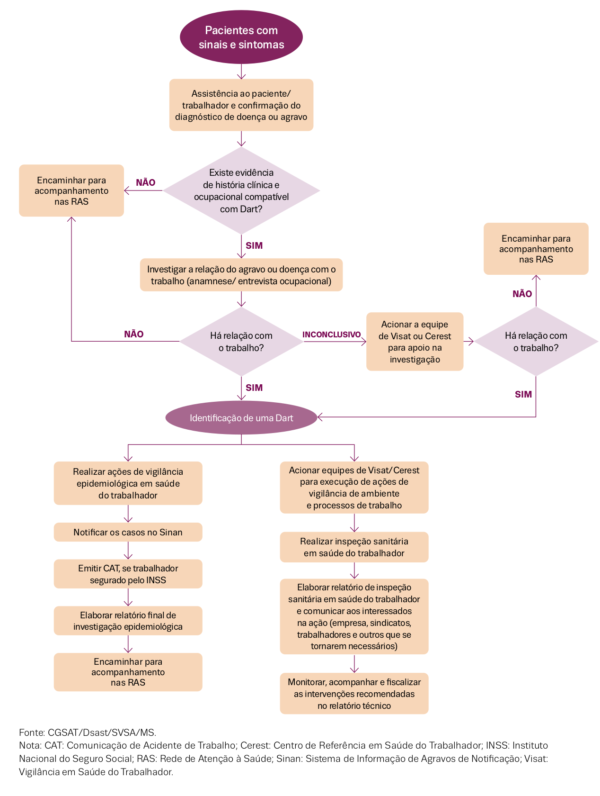{#fluxo_ACGR}

Fonte: @ministeriodasaudeGuiaVigilanciaEm2024a

### AIDS em adultos

-  Prefixo dos arquivos: AIDA
-  Códigos CID-10
  -  Infecção pelo HIV: Z21
  -  Aids: B20-B24
  -  Gestante HIV: Z21
  -  Criança exposta ao HIV: Z20.6

### AIDS em crianças

-  Prefixo dos arquivos: AIDC
-  Código CID-10 (Criança exposta ao HIV): Z20.6

### Acidentes por Animais Peçonhentos

-  Prefixo dos arquivos: ANIM
-  Códigos CID-10
   -  Acidente ofídico: X20 e T63.0
   -  Escorpionismo: X22 e T63.2
   -  Araneísmo: X21 e T63.3
   -  Lonomia e outras lagartas: X25 e T63.4
   -  Himenópteros (abelhas, vespas e formigas): X23 e T63.4
-  [Ficha de notificação](assets/sinan/agravos/ANIMPN_FICHA.pdf)
-  [Instrucional](assets/sinan/agravos/ANIMPN_INSTRUCIONAL.pdf)
-  [Roteiro de uso](assets/sinan/agravos/ANIMPN_CADERNO_ANALISES.pdf)
-  [Dicionário de dados](assets/sinan/agravos/ANIMPN_DIC_DADOS.pdf)

### Atendimento antirrábico

-  Prefixo dos arquivos: ANTR

### Botulismo

-  Prefixo dos arquivos: BOTU
-  CID-10: A05.1
-  [Ficha de notificação](assets/sinan/agravos/BOTUN_FICHA.pdf)
-  [Instrucional](assets/sinan/agravos/BOTUN_INSTRUCIONAL.pdf)
-  [Dicionário de dados](assets/sinan/agravos/BOTUN_DIC_DADOS.pdf)

### Câncer relacionado ao trabalho

-  Prefixo dos arquivos: CANC

### Doença de Chagas

-  Prefixo dos arquivos: CHAG
-  CID-10: B57
-  [Ficha de notificação](assets/sinan/agravos/CHAGAN_FICHA.pdf)
-  [Instrucional](assets/sinan/agravos/CHAGAN_INSTRUCIONAL.pdf)
-  [Dicionário de dados](assets/sinan/agravos/CHAGAN_DIC_DADOS.pdf)

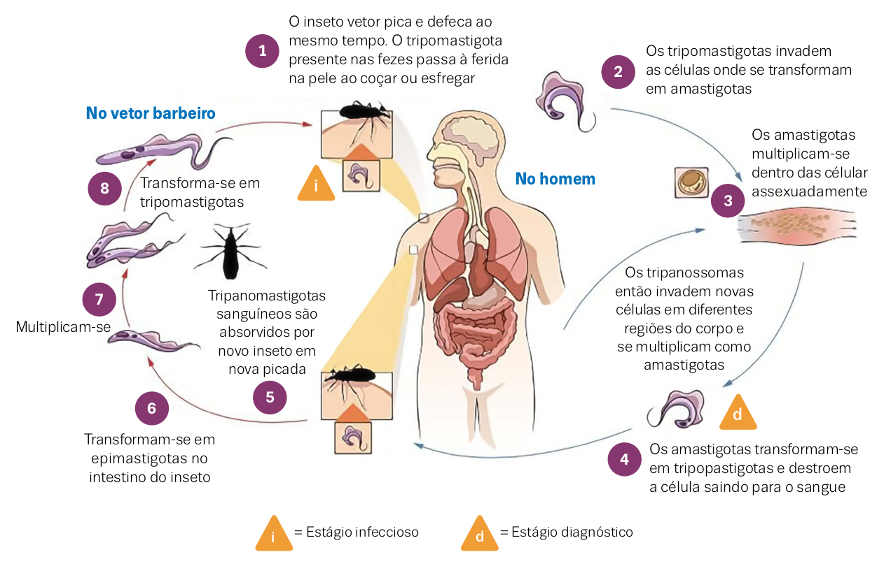{#ciclo_chagas}

Fonte: @ministeriodasaudeGuiaVigilanciaEm2024

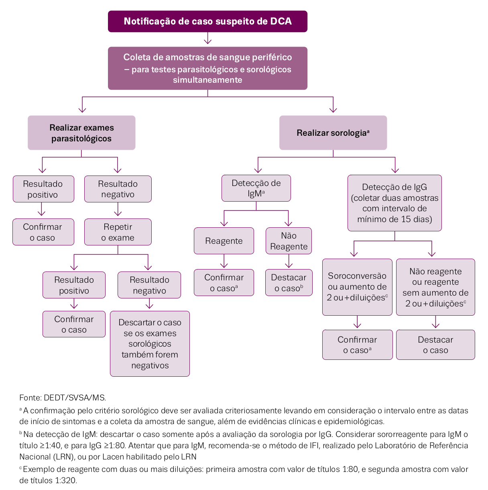{#fluxo_chagas_aguda}

Fonte: @ministeriodasaudeGuiaVigilanciaEm2024


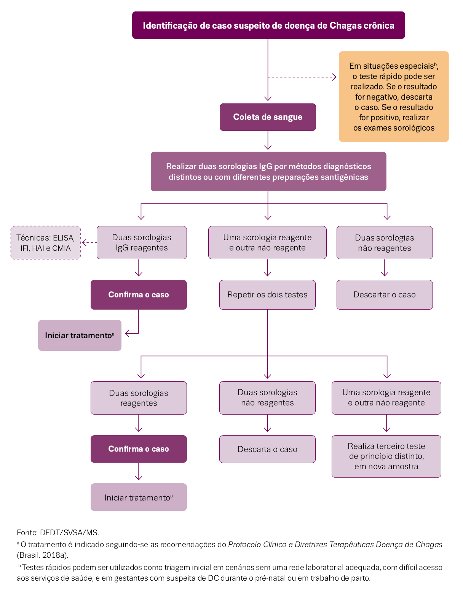{#fluxo_chagas_cronica}

Fonte: @ministeriodasaudeGuiaVigilanciaEm2024


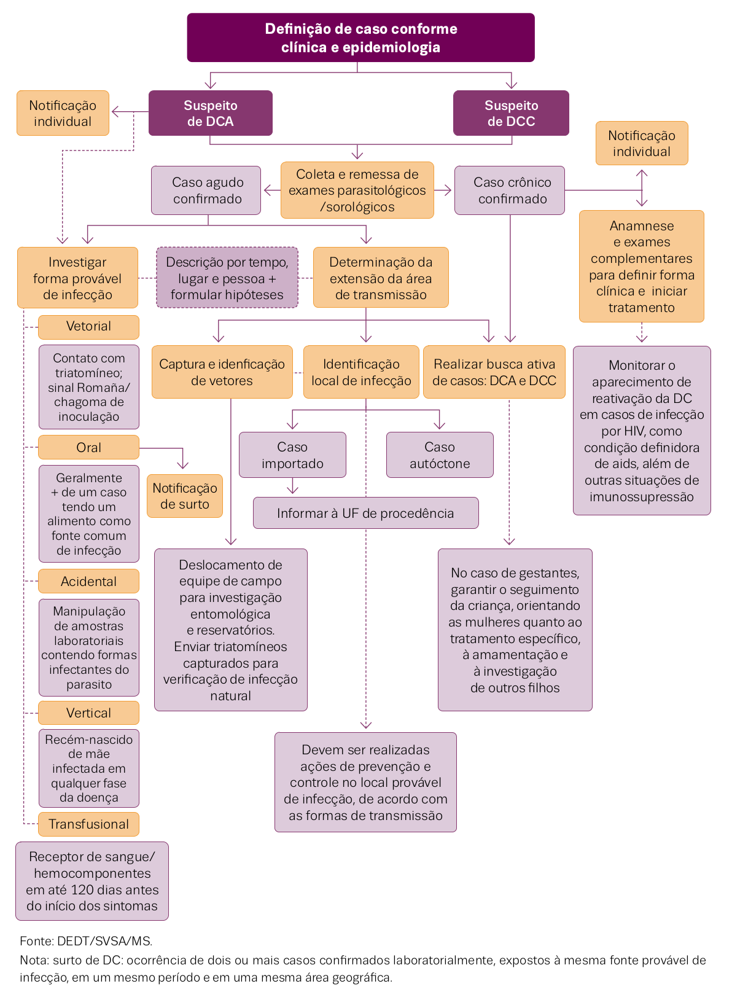{#invest_chagas}

Fonte: @ministeriodasaudeGuiaVigilanciaEm2024

### Chikungunya

-  Prefixo dos arquivos: CHIK
-  [OpenDataSUS](https://opendatasus.saude.gov.br/dataset/arboviroses-febre-de-chikungunya)

### Cólera

-  Prefixo dos arquivos: COLE
-  Código CID-10: A00
-  [Ficha de notificação](assets/sinan/agravos/COLEN_FICHA.pdf)
-  [Instrucional](assets/sinan/agravos/COLEN_INSTRUCIONAL.pdf)
-  [Dicionário de dados](assets/sinan/agravos/COLEN_DIC_DADOS.pdf)

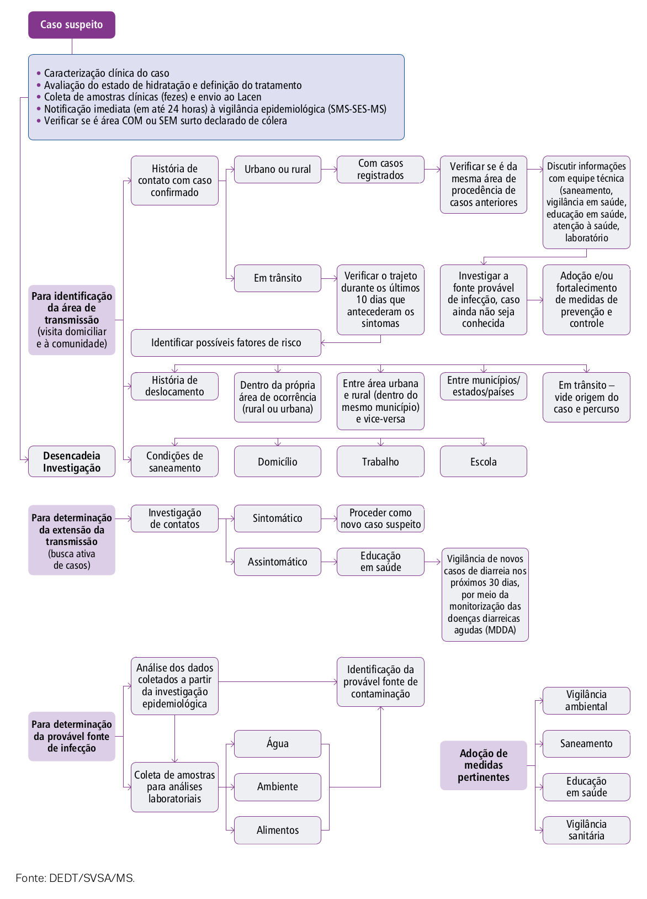{#fluxo_colera}

Fonte: @ministeriodasaudeGuiaVigilanciaEm2024a

### Coqueluche

-  Prefixo dos arquivos: COQU
-  CID-10: A37
-  [Ficha de notificação](assets/sinan/agravos/COQUEN_FICHA.pdf)
-  [Instrucional](assets/sinan/agravos/COQUEN_INSTRUCIONAL.pdf)
-  [Dicionário de dados](assets/sinan/agravos/COQUEN_DIC_DADOS.pdf)

### Dengue

-  Prefixo dos arquivos: DENG
-  [Ficha de notificação](assets/sinan/agravos/DENGON_FICHA.pdf)
-  [Instrucional](assets/sinan/agravos/DENGON_INSTRUCIONAL.pdf)
-  [Dicionário de dados](assets/sinan/agravos/DENGON_DIC_DADOS.pdf)
-  [Nota informativa](assets/sinan/agravos/DENGON_NOTA_INFORMATIVA.pdf)
-  [OpenDataSUS](https://opendatasus.saude.gov.br/dataset/arboviroses-dengue)

### Dermatoses ocupacionais

-  Prefixo dos arquivos: DERM
-  CID-10: L98.9

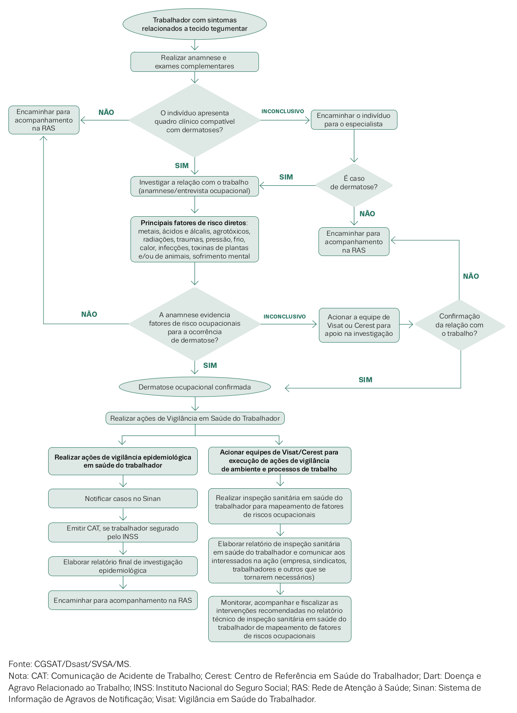{#fluxo_dermatose_ocup}

Fonte: @ministeriodasaudeGuiaVigilanciaEm2024b

### Esporotricose (Epizootia)

-  Prefixo dos arquivos: ESPO
-  CID-10: B42

### HIV em adultos

-  Prefixo dos arquivos: HIVA

### HIV em crianças

-  Prefixo dos arquivos: HIVC

### HIV em crianças expostas

-  Prefixo dos arquivos: HIVE

### HIV em gestante

-  Prefixo dos arquivos: HIVG

### Influenza pandêmica

-  Prefixo dos arquivos: INFL

### Rotavírus

-  Prefixo dos arquivos: ROTA
-  CID-10: A08.0
-  [Dicionário de dados](assets/sinan/agravos/DIC_DADOS_ROTA_NET_v5.1.pdf)

### Surto de doenças transmitidas por alimentos

-  Prefixo dos arquivos: SDTA

### Difteria

-  Prefixo dos arquivos: DIFT
-  CID-10: A36
-  [Ficha de notificação](assets/sinan/agravos/DIFTEN_FICHA.pdf)
-  [Instrucional](assets/sinan/agravos/DIFTEN_INSTRUCIONAL.pdf)
-  [Dicionário de dados](assets/sinan/agravos/DIFTEN_DIC_DADOS.pdf)

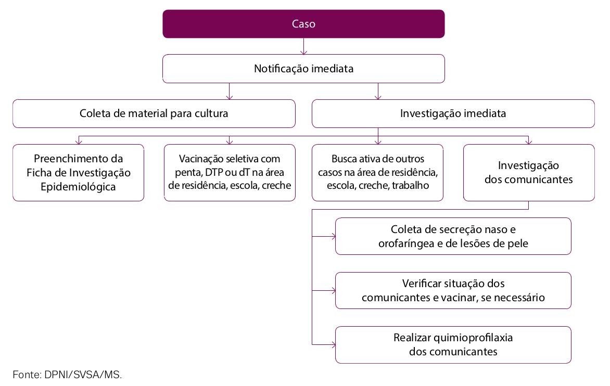{#fluxo_difteria}

Fonte: @ministeriodasaudeGuiaVigilanciaEm2024a

### Esquistossomose mansoni

-  Prefixo dos arquivos: ESQU
-  CID-10: B65.1
-  [Ficha de notificação](assets/sinan/agravos/ESQUIN_FICHA.pdf)
-  [Instrucional](assets/sinan/agravos/ESQUIN_INSTRUCIONAL.pdf)
-  [Dicionário de dados](assets/sinan/agravos/ESQUIN_DIC_DADOS.pdf)

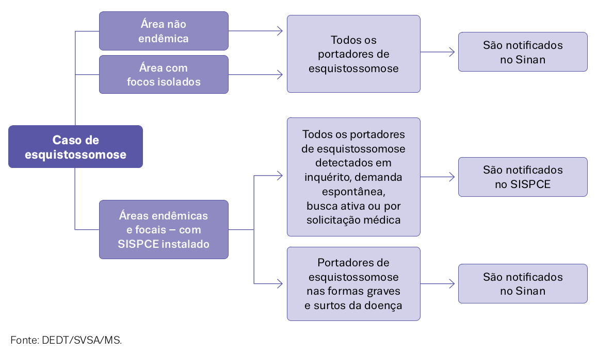{#fluxo_esquistossomose}

Fonte: @ministeriodasaudeGuiaVigilanciaEm2024

### Doenças Exantemáticas

-  Prefixo dos arquivos: EXAN
-  [Ficha de notificação](assets/sinan/agravos/EXANT_FICHA.pdf)
-  [Instrucional](assets/sinan/agravos/EXANT_INSTRUCIONAL.pdf)
-  [Dicionário de dados](assets/sinan/agravos/EXANT_DIC_DADOS.pdf)

### Febre Amarela

-  CID-10: A95
-  [Ficha de notificação](assets/sinan/agravos/FAMARN_FICHA.pdf)
-  [Instrucional](assets/sinan/agravos/FAMARN_INSTRUCIONAL.pdf)
-  [Dicionário de dados](assets/sinan/agravos/FAMARN_DIC_DADOS.pdf)
-  [OpenDataSUS](https://opendatasus.saude.gov.br/dataset/febre-amarela-em-humanos-e-primatas-nao-humanos)

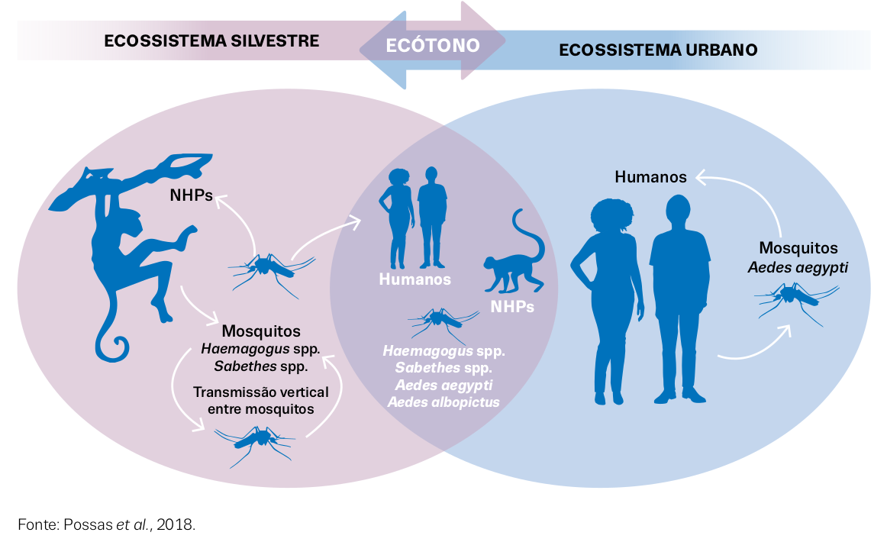{#fluxo_febre_amarela}

Fonte: @ministeriodasaudeGuiaVigilanciaEm2024

### Febre Maculosa

-  Prefixo dos arquivos: FMAC
-  CID-10
   -  Rickettsioses transmitidas por carrapatos: A77
   -  Febre maculosa brasileira: A77.0
   -  Febre maculosa não especificada: A77.9
-  [Ficha de notificação](assets/sinan/agravos/FMACUN_FICHA.pdf)
-  [Instrucional](assets/sinan/agravos/FMACUN_INSTRUCIONAL.pdf)
-  [Dicionário de dados](assets/sinan/agravos/FMACUN_DIC_DADOS.pdf)

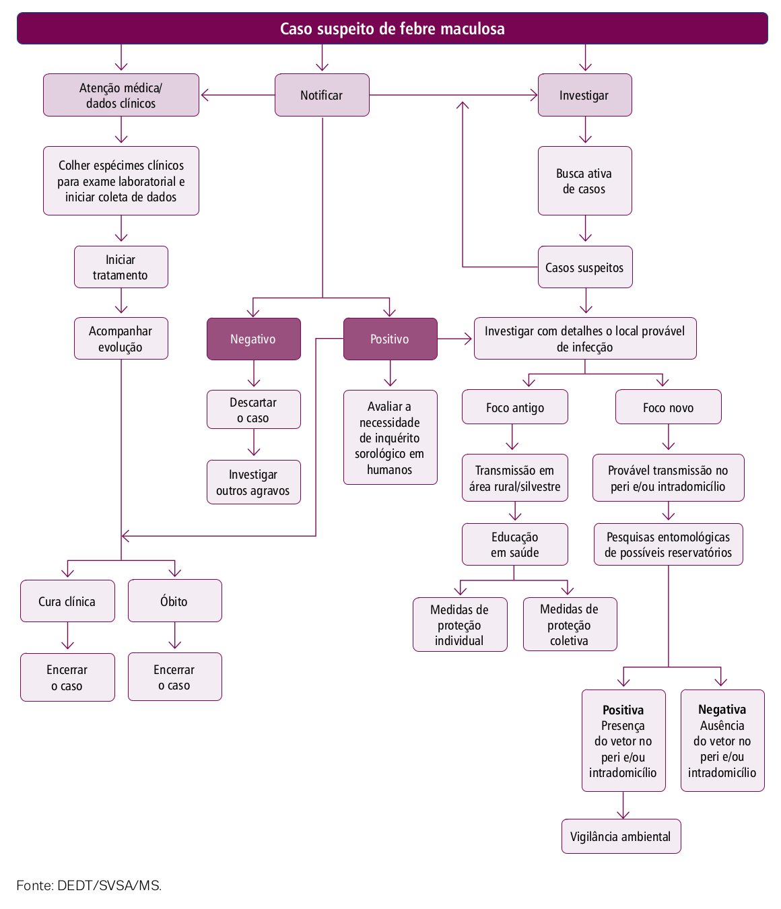{#fluxo_febre_maculosa}

Fonte: @ministeriodasaudeGuiaVigilanciaEm2024b

### Febre Oropouche

-  [POP de manuseio do e-SUS Sinan para a notificação de Febre Oropouche ](assets/sinan/esus/POP-manuseio-e-SUS-Sinan-notificacao-Febre-Oropouche.pdf)

### Febre Tifóide

-  Prefixo dos arquivos: FTIF
-  CID-10: A01.0
-  [Ficha de notificação](assets/sinan/agravos/FTIFON_FICHA.pdf)
-  [Instrucional](assets/sinan/agravos/FTIFON_INSTRUCIONAL.pdf)
-  [Dicionário de dados](assets/sinan/agravos/FTIFON_DIC_DADOS.pdf)

### Hanseníase

-  Prefixo dos arquivos: HANS
-  CID-10: A30
-  [Ficha de notificação](assets/sinan/agravos/HANSN_FICHA.pdf)
-  [Instrucional](assets/sinan/agravos/HANSN_INSTRUCIONAL.pdf)
-  [Caderno de análise](assets/sinan/agravos/HANSN_CADERNO_ANALISES.pdf)
-  [Dicionário de dados](assets/sinan/agravos/HANSN_DIC_DADOS.pdf)

### Hantavirose

-  Prefixo dos arquivos: HANT
-  CID-10: B33.4
-  [Ficha de notificação](assets/sinan/agravos/HANTAN_FICHA.pdf)
-  [Instrucional](assets/sinan/agravos/HANTAN_INSTRUCIONAL.pdf)
-  [Dicionário de dados](assets/sinan/agravos/HANTAN_DIC_DADOS.pdf)

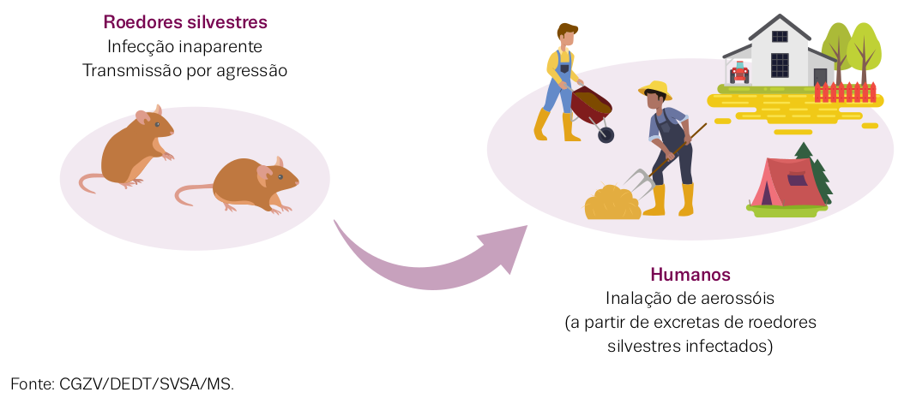{#fluxo_hantavirose}

Fonte: @ministeriodasaudeGuiaVigilanciaEm2024b

### Hepatites Virais

-  Prefixo dos arquivos: HEPA
-  CID-10: B15 – B19.9
-  [Ficha de notificação](assets/sinan/agravos/HEPANET_FICHA.pdf)
-  [Instrucional](assets/sinan/agravos/HEPANET_INSTRUCIONAL.pdf)
-  [Dicionário de dados](assets/sinan/agravos/HEPANET_DIC_DADOS.pdf)

### Intoxicação Exógena

-  Prefixo dos arquivos: IEXO
-  [Ficha de notificação](assets/sinan/agravos/IEXOGN_FICHA.pdf)
-  [Instrucional](assets/sinan/agravos/IEXOGN_INSTRUCIONAL.pdf)
-  [Dicionário de dados](assets/sinan/agravos/IEXOGN_DIC_DADOS.pdf)

### Leishmaniose Tegumentar Americana

-  Prefixo dos arquivos: LTAN
-  CID-10: B55.1
-  [Ficha de notificação](assets/sinan/agravos/LTAN_FICHA.pdf)
-  [Instrucional](assets/sinan/agravos/LTAN_INSTRUCIONAL.pdf)
-  [Caderno de análises](assets/sinan/agravos/LTAN_CADERNO_ANALISES.pdf)
-  [Dicionário de dados](assets/sinan/agravos/LTAN_DIC_DADOS.pdf)

### Leishmaniose Visceral

-  Prefixo dos arquivos: LEIV
-  CID-10: B55.0
-  [Ficha de notificação](assets/sinan/agravos/LEISHN_FICHA.pdf)
-  [Instrucional](assets/sinan/agravos/LEISHN_INSTRUCIONAL.pdf)
-  [Caderno de análise](assets/sinan/agravos/LEISHN_CADERNO_ANALISES.pdf)
-  [Dicionário de dados](assets/sinan/agravos/LEISHN_DIC_DADOS.pdf)

### Leptospirose

-  Prefixo dos arquivos: LEPT
-  CID-10: A27
-  [Ficha de notificação](assets/sinan/agravos/LEPTON_FICHA.pdf)
-  [Instrucional](assets/sinan/agravos/LEPTON_INSTRUCIONAL.pdf)
-  [Dicionário de dados](assets/sinan/agravos/LEPTON_DIC_DADOS.pdf)

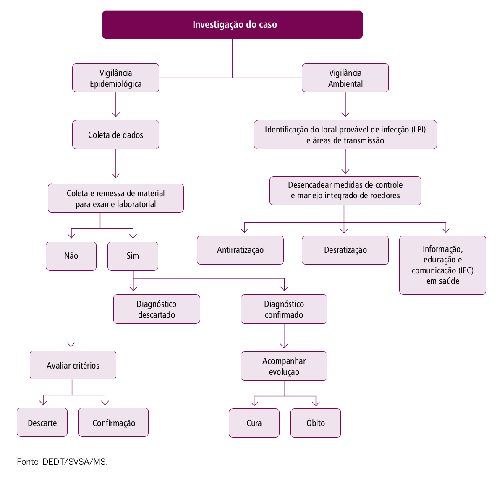{#fluxo_leptospirose}

Fonte: @ministeriodasaudeGuiaVigilanciaEm2024b

### LER/DOT

-  Prefixo dos arquivos: LERD

### Malária

-  Prefixo dos arquivos: MALA
-  CID-10: B50 a B54 / P37.3 e P37.4
-  [Ficha de notificação](assets/sinan/agravos/MALAN_FICHA.pdf)
-  [Instrucional](assets/sinan/agravos/MALAN_INSTRUCIONAL.pdf)
-  [Dicionário de dados](assets/sinan/agravos/MALAN_DIC_DADOS.pdf)

::: {.callout-caution}
A notificação de casos de malária no SINAN cobre a região extra-amazônica. Casos de malária na região amazônica são notificados no SIVEP Malária (@sec-sivep).
:::

### Meningite

-  Prefixo dos arquivos: MENI
-  CID-10
   - Meningite meningocócica: A39.0
   - Meningococcemia aguda: A39.2
-  [Ficha de notificação](assets/sinan/agravos/MENIN_FICHA.pdf)
-  [Instrucional](assets/sinan/agravos/MENIN_INSTRUCIONAL.pdf)
-  [Caderno de análises](assets/sinan/agravos/MENIN_CADERNO_ANALISES.pdf)
-  [Tutorial de análises epidemiológicas](assets/sinan/agravos/MENIN_TUTORIAL_ANALISES_EPIDEMIO.pdf)
-  [Dicionário de dados](assets/sinan/agravos/MENIN_DIC_DADOS.pdf)

### Transtornos mentais relacionais ao trabalho 

-  Prefixo dos arquivos: MENT

### Notificação de tracoma

-  Prefixo dos arquivos: NTRA
-  CID-10
   -  Tracoma: A71
   -  Sequelas de tracoma: B94.0

### Inquérito de tracoma

-  Prefixo dos arquivos: TRAC

### Perda auditiva por ruído relacionado ao trabalho

-  Prefixo dos arquivos: PAIR

### Monkeypox

A notificação de Monkeypox (Mpox) está sendo realizada com o [e-SUS SINAN](http://plataforma.saude.gov.br/esussinan/), uma nova versão do SINAN.

-  [Ficha de notificação](assets/sinan/esus/ficha-investigacao-monkeypox-e-SUS-Sinan.pdf)
-  [Dicionário de dados](assets/sinan/esus/dicionario-investigacao-monkeypox-esussinan.pdf)
-  [OpenDataSUS](https://opendatasus.saude.gov.br/dataset/mpox)

### Notificação Individual

-  [Ficha de notificação](assets/sinan/agravos/NINDIN_FICHA.pdf)
-  [Dicionário de dados](assets/sinan/agravos/NINDIN_DIC_DADOS.pdf)

### Notificação Individual e-SUS SINAN

-  [Ficha individual de notificação](assets/sinan/esus/ficha-individual-notificacao-conclusao-e-SUS-Sinan.pdf)
-  [Modelo de informação da ficha de notificação](assets/sinan/esus/modelo-informacao-ficha-notificacao-conclusao-e-SUS-Sinan.pdf)

### Peste

-  Prefixo dos arquivos: PEST
-  CID-10: A20
-  [Ficha de notificação](assets/sinan/agravos/PESTEN_FICHA.pdf)
-  [Instrucional](assets/sinan/agravos/PESTEN_INSTRUCIONAL.pdf)
-  [Dicionário de dados](assets/sinan/agravos/PESTEN_DIC_DADOS.pdf)

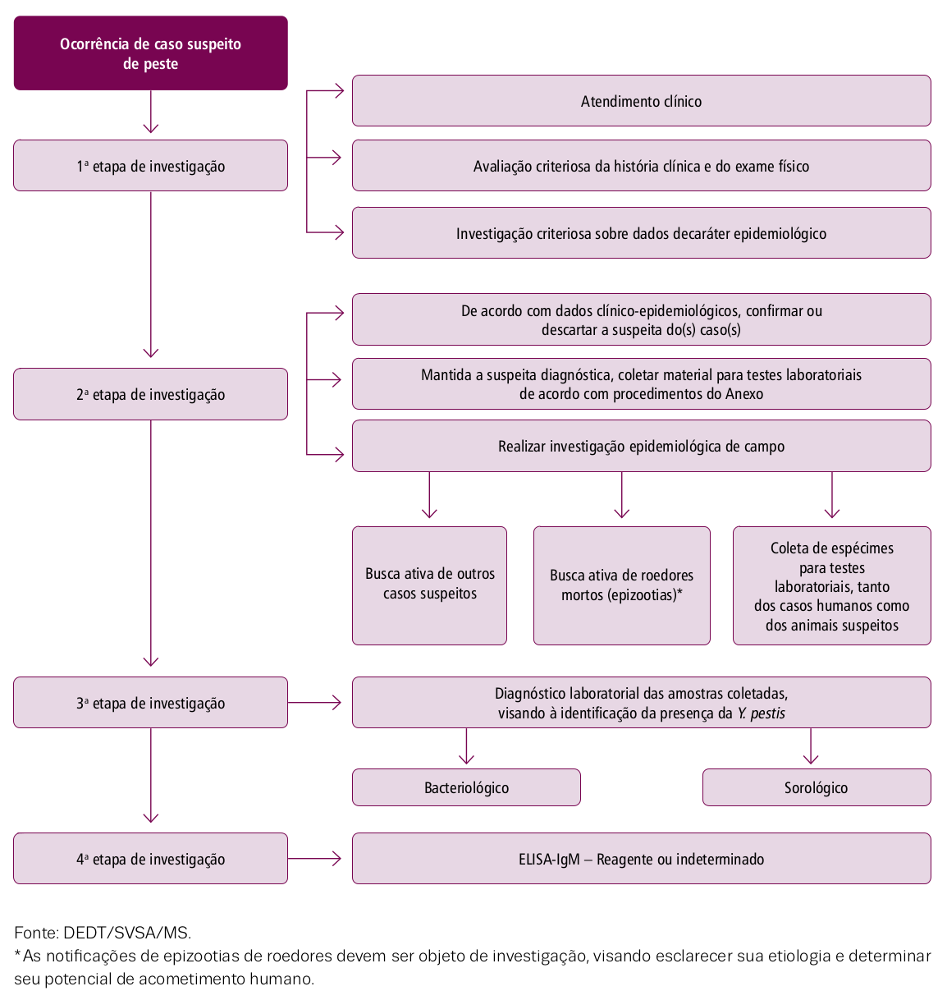{#fluxo_peste}

Fonte: @ministeriodasaudeGuiaVigilanciaEm2024b

### Poliomielite / Paralisia Flácida Aguda

-  Prefixo dos arquivos: PFAN
-  CID-10: A80
-  [Ficha de notificação](assets/sinan/agravos/PFAN_FICHA.pdf)
-  [Instrucional](assets/sinan/agravos/PFAN_INSTRUCIONAL.pdf)
-  [Dicionário de dados](assets/sinan/agravos/PFAN_FICHA.pdf)

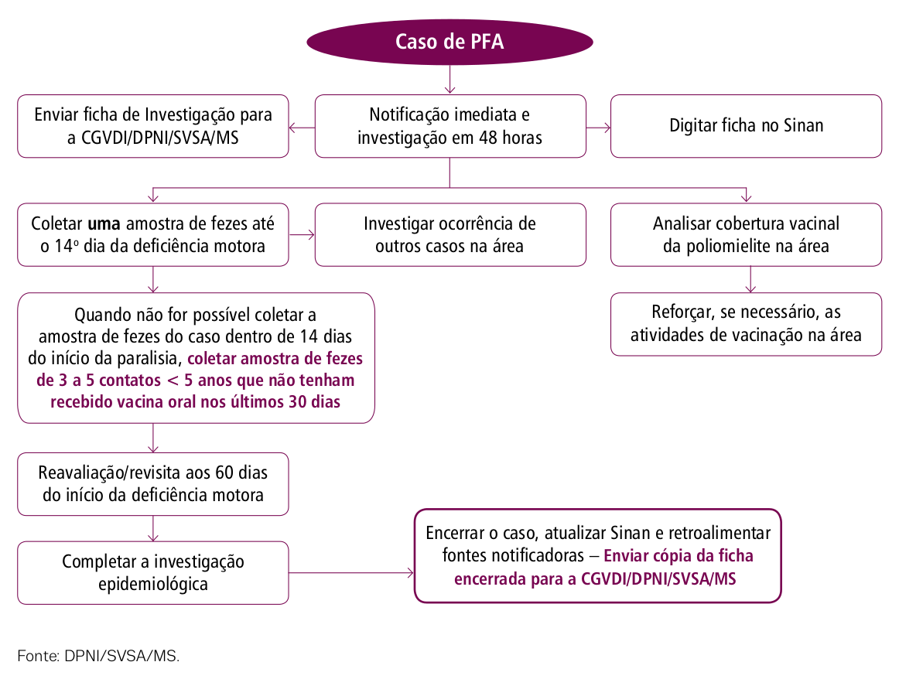{#fluxo_poliomelite}

Fonte: @ministeriodasaudeGuiaVigilanciaEm2024a

### Pneumoconioses relacionadas ao trabalho

-  Prefixo dos arquivos: PNEU
-  CID-10: J64

### Raiva Humana

-  Prefixo dos arquivos: RAIV
-  CID-10: A82
-  [Ficha de notificação](assets/sinan/agravos/RAIVAN_FICHA.pdf)
-  [Instrucional](assets/sinan/agravos/RAIVAN_INSTRUCIONAL.pdf)
-  [Dicionário de dados](assets/sinan/agravos/RAIVAN_DIC_DADOS.pdf)

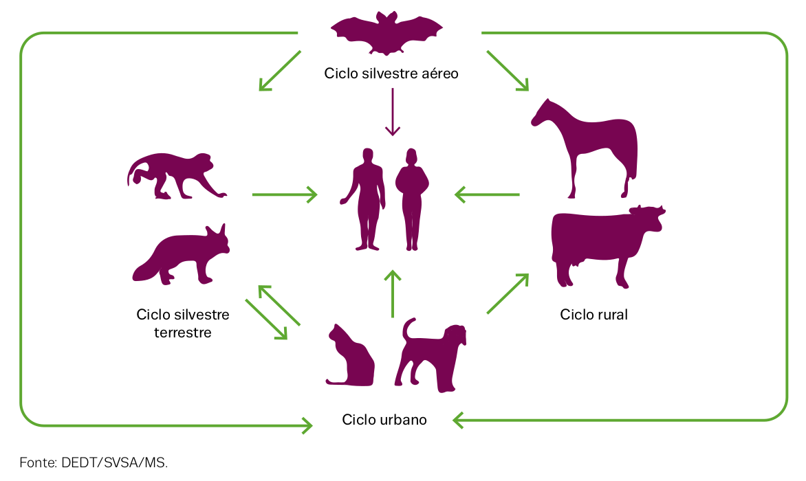{#fluxo_raiva}

Fonte: @ministeriodasaudeGuiaVigilanciaEm2024b

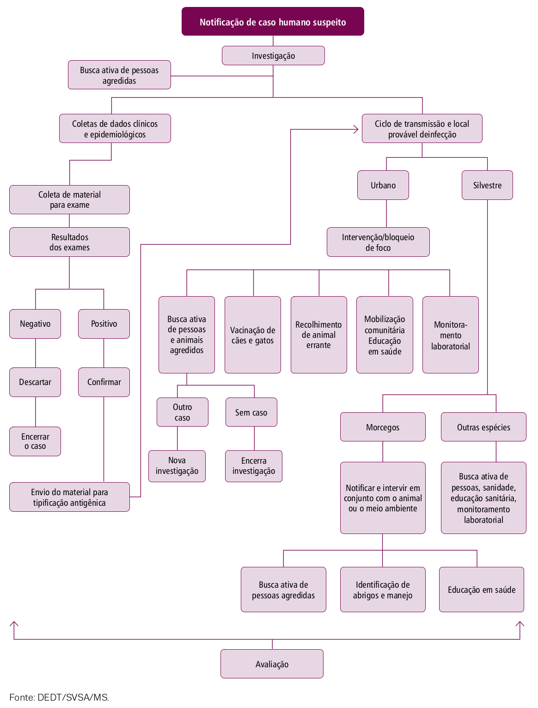{#fluxo_raiva_roteiro}

Fonte: @ministeriodasaudeGuiaVigilanciaEm2024b

### Sífilis adquirida

-  Prefixo dos arquivos: SIFA
-  CID-10: A53.9

### Sífilis Congênita

-  Prefixo dos arquivos: SIFC
-  CID-10: A50
-  [Ficha de notificação](assets/sinan/agravos/SIFICN_FICHA.pdf)
-  [Instrucional](assets/sinan/agravos/SIFICN_INSTRUCIONAL.pdf)
-  [Nota informativa](assets/sinan/agravos/SIFICN_NOTA_INFORMATIVA.pdf)
-  [Dicionário de dados](assets/sinan/agravos/SIFICN_DIC_DADOS.pdf)

### Sífilis em Gestante

-  Prefixo dos arquivos: SIFG
-  CID-10: O98.1
-  [Ficha de notificação](assets/sinan/agravos/SIFIGEN_FICHA.pdf)
-  [Instrucional](assets/sinan/agravos/SIFIGEN_INSTRUCIONAL.pdf)
-  [Nota informativa](assets/sinan/agravos/SIFIGEN_NOTA_INFORMATIVA.pdf)
-  [Dicionário de dados](assets/sinan/agravos/SIFIGEN_DIC_DADOS.pdf)

### Síndrome da Rubéola Congênita

-  Prefixo dos arquivos: SRC
-  CID-10: P35.0
-  [Ficha de notificação](assets/sinan/agravos/SRCN_FICHA.pdf)
-  [Instrucional](assets/sinan/agravos/SRCN_INSTRUCIONAL.pdf)
-  [Dicionário de dados](assets/sinan/agravos/SRCN_DIC_DADOS.pdf)

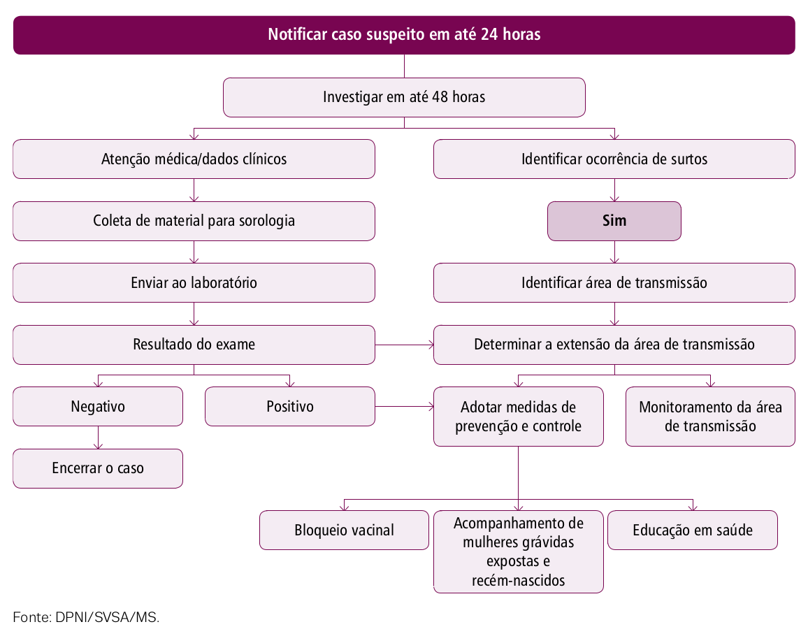{#fluxo_rubeola}

Fonte: @ministeriodasaudeGuiaVigilanciaEm2024a

### Tétano Acidental

-  Prefixo dos arquivos: TETA
-  CID-10: A35
-  [Ficha de notificação](assets/sinan/agravos/TETACN_FICHA.pdf)
-  [Instrucional](assets/sinan/agravos/TETACN_INSTRUCIONAL.pdf)
-  [Dicionário de dados](assets/sinan/agravos/TETACN_DIC_DADOS.pdf)

### Tétano Neonatal

-  Prefixo dos arquivos: TETN
-  CID-10: A33
-  [Ficha de notificação](assets/sinan/agravos/TETANN_FICHA.pdf)
-  [Instrucional](assets/sinan/agravos/TETANN_INSTRUCIONAL.pdf)
-  [Dicionário de dados](assets/sinan/agravos/TETANN_DIC_DADOS.pdf)

### Toxoplasmose congênita

-  Prefixo dos arquivos: TOXC
-  CID-10: P37.1

### Toxoplasmose gestacional

-  Prefixo dos arquivos: TOXG
-  CID-10: O98.6

### Tuberculose

-  Prefixo dos arquivos: TUBE
-  CID-10: A15 a A19; J65; K93.0; M49.0; M90.0; N74.0; N74.1; O98.0; P37.0
-  [Ficha de notificação](assets/sinan/agravos/TUBEN_FICHA.pdf)
-  [Ficha de acompanhamento](assets/sinan/agravos/TUBEN_FICHA_ACOMP.pdf)
-  [Instrucional](assets/sinan/agravos/TUBEN_INSTRUCIONAL.pdf)
-  [Dicionário de dados](assets/sinan/agravos/TUBEN_DIC_DADOS.pdf)

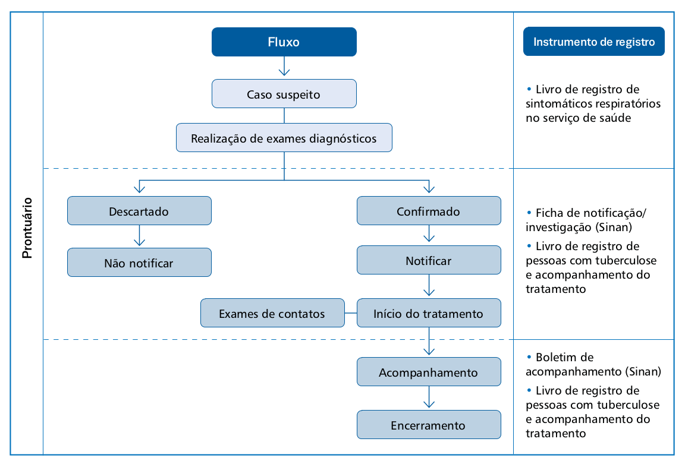{#fluxo_tuberculose}

Fonte: @ministeriodasaudeGuiaVigilanciaEm2024

### Varicela / Herpes-Zóster

-  Prefixo dos arquivos: VARC
-  CID-10: B01/B02

### Violência doméstica, sexual e/ou outras violências

-  Prefixo dos arquivos: VIOL

### Violência Interpessoal/Autoprovocada

-  CID-10: Y09
-  [Ficha de notificação](assets/sinan/agravos/VIOLEN_FICHA.pdf)
-  [Caderno de Análise](assets/sinan/agravos/VIOLEN_CADERNO_ANALISE.pdf)
-  [Dicionário de dados](assets/sinan/agravos/VIOLEN_DIC_DADOS.pdf)

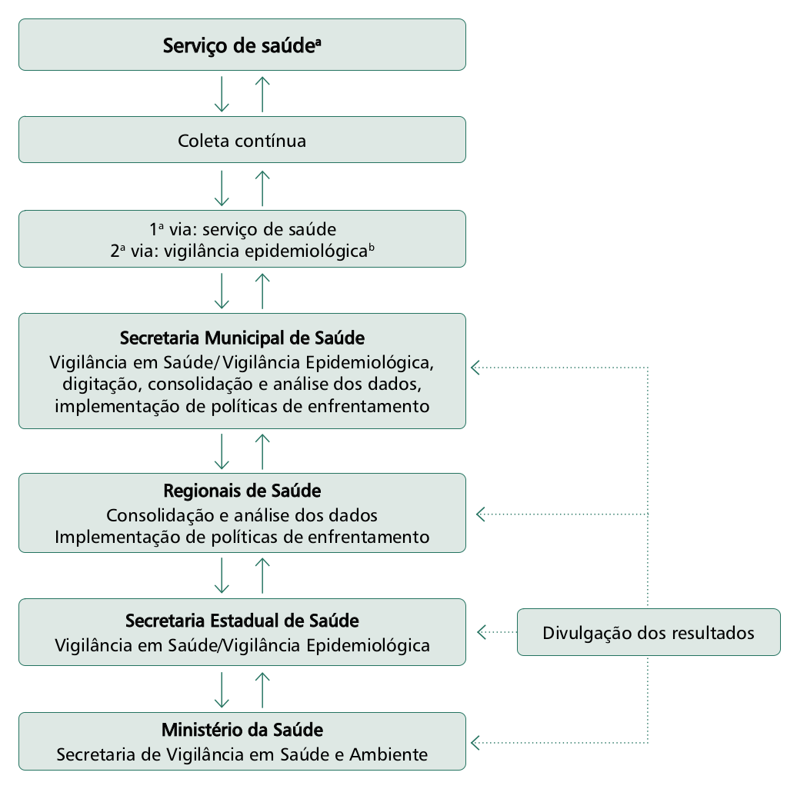{#fluxo_violencia}

Fonte: @ministeriodasaudeGuiaVigilanciaEm2024b

### Zika vírus

-  Prefixo dos arquivos: ZIKA
-  [OpenDataSUS](https://opendatasus.saude.gov.br/dataset/arboviroses-zika-virus)

## Acesso aos dados

Os dados do SINAN podem ser acessados por diferentes caminhos. A melhor opção depende do agravo, da necessidade de microdados, da atualização desejada e do grau de reprodutibilidade do fluxo.

| Forma de acesso | Indicação de uso |
|---|---|
| TabNet | Tabulações rápidas e consultas agregadas |
| TabWin/DBC | Download e tabulação local de arquivos do DataSUS |
| R | Fluxos reprodutíveis com `{microdatasus}` quando o agravo estiver disponível |
| Python | Fluxos reprodutíveis com PySUS |
| OpenDataSUS | Bases abertas de alguns agravos, especialmente arboviroses e emergências |
| PCDaS | Uso em ambiente de notebooks e infraestrutura de dados |
| InfoDengue | Monitoramento oportuno de arboviroses com correção de atraso |
: Formas de acesso aos dados do SINAN

### TabNet

Os dados do SINAN podem ser acessados no sistema TabNet do DataSUS, na seção "Epidemiológicas e Morbidade".

- [TabNet SINAN](https://datasus.saude.gov.br/informacoes-de-saude-tabnet/)

### TabWin e transferência de arquivos

Para uso no TabWin ou em fluxos próprios de processamento, é possível baixar arquivos de dados no formato DBC e arquivos auxiliares para tabulação no serviço de transferência de arquivos do DataSUS.

- [TabWin - Transferência de arquivos](https://datasus.saude.gov.br/transferencia-de-arquivos/)

Em análises reprodutíveis, registre o agravo, prefixo do arquivo, UF, ano, data de acesso e versão do script de leitura. Como os layouts variam por agravo, guarde também o dicionário de dados usado.

### R

O pacote [`{microdatasus}`](https://rfsaldanha.github.io/microdatasus/index.html) permite baixar e processar alguns microdados do DataSUS em R [@Saldanha2019a].

```{r}
#| eval: false
#| message: false
library(microdatasus)

sinan_raw <- fetch_datasus(
  year_start = 2017,
  year_end = 2017,
  information_system = "SINAN-DENGUE"
)

sinan_p <- process_sinan_dengue(sinan_raw)

sinan_p
```

### Python

A biblioteca PySUS também permite acessar dados do SINAN em fluxos de análise em Python.

- [PySUS SINAN](https://pysus.readthedocs.io/en/latest/databases/SINAN.html)

### OpenDataSUS

O Ministério da Saúde disponibiliza arquivos atualizados no OpenDataSUS para as seguintes notificações:

- [Dengue](https://opendatasus.saude.gov.br/dataset/arboviroses-dengue)
- [Zika](https://opendatasus.saude.gov.br/dataset/arboviroses-zika-virus)
- [Chikungunya](https://opendatasus.saude.gov.br/dataset/arboviroses-febre-de-chikungunya)
- [Mpox](https://opendatasus.saude.gov.br/dataset/mpox)
- [Febre Amarela](https://opendatasus.saude.gov.br/dataset/febre-amarela-em-humanos-e-primatas-nao-humanos)

### PCDaS

Algumas bases do SINAN podem ser analisadas em ambientes de notebooks e infraestrutura de dados da Plataforma de Ciência de Dados aplicada à Saúde (PCDaS) [@pedrosoDataSciencePlatform2023].

- [PCDaS](https://pcdas.icict.fiocruz.br/)

### InfoDengue

O projeto InfoDengue, mantido pela FGV EMAp e Fiocruz, apresenta estimativas da incidência da Dengue a partir de dados do SINAN, usando técnicas de *nowcasting* para reduzir os efeitos do atraso de notificação. O acesso aos dados é possível por uma API.

- [InfoDengue](https://info.dengue.mat.br)
- [InfoDengue API](https://info.dengue.mat.br/services/)

## Relacionamento com outros sistemas

O SINAN é frequentemente combinado com outros sistemas para qualificar desfechos, gravidade, denominadores e rede assistencial.

| Pergunta | Fontes combinadas | Cuidado principal |
|---|---|---|
| O caso notificado evoluiu para óbito? | SINAN + SIM (@sec-sim) | Harmonizar identificação, datas e causa |
| O caso foi internado? | SINAN + SIH (@sec-sih) | Definir janela entre notificação e internação |
| Houve procedimento ambulatorial relacionado? | SINAN + SIA (@sec-sia) | Separar produção de caso notificado |
| Qual taxa de incidência? | SINAN + POP (@sec-pop) | Usar residência e população compatível |
| Qual serviço notificou ou acompanhou? | SINAN + CNES (@sec-cnes) | CNES muda ao longo do tempo |
| O evento envolve nascimento ou gestação? | SINAN + SINASC (@sec-sinasc) | Definir unidade: mãe, gestação, nascimento ou caso |
: Integrações frequentes entre SINAN e outros sistemas

Em relacionamentos de registros, defina previamente se a unidade final será pessoa, caso, episódio, notificação, internação ou óbito. Essa definição muda regras de pareamento, deduplicação e janelas temporais.

## SINAN e SIVEP

SINAN e SIVEP (@sec-sivep) são sistemas de vigilância, mas não devem ser tratados como equivalentes. O SINAN organiza a notificação e investigação de uma ampla lista de doenças e agravos; o SIVEP reúne componentes específicos, como SIVEP-Gripe para SRAG e vigilância de vírus respiratórios, e SIVEP-Malária para malária em áreas e fluxos específicos.

| Pergunta | Sistema mais provável | Cuidado |
|---|---|---|
| Casos suspeitos ou confirmados de agravos da lista nacional | SINAN | Verificar ficha e classificação final |
| Síndrome Respiratória Aguda Grave | SIVEP-Gripe | Não substituir por notificações gerais do SINAN |
| Malária na região amazônica | SIVEP-Malária | SINAN cobre principalmente região extra-amazônica |
| Malária extra-amazônica | SINAN | Confirmar fluxo local e definição vigente |
| Monitoramento de vírus respiratórios | SIVEP-Gripe | Unidade e campos diferem do SINAN |
| Agravos com ficha específica de investigação | SINAN | Pode exigir acompanhamento ou encerramento |
: Diferenças práticas entre SINAN e SIVEP

Quando um agravo aparece em mais de um fluxo de vigilância, escolha o sistema a partir da definição operacional do evento, do território e do período. Misturar bases sem harmonização pode duplicar casos ou comparar eventos diferentes.

## Principais usos e indicadores

Os dados do SINAN são usados em indicadores de vigilância, incidência, oportunidade, encerramento, letalidade, positividade, perfil dos casos e monitoramento de surtos.

| Indicador | Numerador principal | Denominador ou cuidado |
|---|---|---|
| Incidência de agravo confirmado | Casos confirmados | População residente |
| Taxa de notificação | Notificações | População residente ou público-alvo |
| Positividade | Confirmados entre notificados encerrados | Separar descartados e inconclusivos |
| Proporção de encerramento oportuno | Casos encerrados no prazo | Definir prazo por agravo |
| Letalidade | Óbitos entre casos confirmados | Confirmar desfecho e vínculo com SIM quando possível |
| Proporção de confirmação laboratorial | Confirmados por critério laboratorial | Depende da disponibilidade de testes |
| Tempo sintomas-notificação | Diferença entre datas | Avaliar datas inconsistentes |
: Exemplos de indicadores construídos com dados do SINAN

## Limitações

O SINAN é essencial para vigilância, mas seus dados refletem o funcionamento da rede de notificação e investigação. Isso deve ser explicitado na interpretação.

| Limitação | Consequência analítica |
|---|---|
| Subnotificação | Incidência observada pode ser menor que a real |
| Atraso de notificação | Bases recentes podem estar incompletas |
| Atraso de encerramento | Classificação final pode mudar após extração |
| Mudança de definição de caso | Séries históricas podem ter quebras |
| Diferenças entre agravos | Campos e fluxos não são diretamente comparáveis |
| Duplicidades | Uma pessoa ou episódio pode aparecer mais de uma vez |
| Mudança de sistema | Transição para e-SUS SINAN pode alterar estrutura e oportunidade |
| Qualidade variável de campos | Raça/cor, escolaridade, local provável de infecção e evolução podem ter incompletude |
: Limitações recorrentes do SINAN

Essas limitações não reduzem a importância do SINAN. Elas indicam que o sistema deve ser analisado como parte de um processo de vigilância, em que suspeita, investigação, confirmação, oportunidade e resposta são tão importantes quanto o número final de casos.

### Limitações por uso

| Uso | Principal risco | Mitigação |
|---|---|---|
| Monitoramento oportuno | Atraso de notificação e digitação | Usar curvas por data de sintomas e considerar nowcasting |
| Estimativa de incidência | Subnotificação e mudança de sensibilidade | Discutir cobertura da vigilância e comparar períodos com cautela |
| Detecção de surtos | Aumento pode refletir busca ativa ou mudança de definição | Integrar investigação local e dados laboratoriais |
| Avaliação de letalidade | Óbitos podem estar incompletos no SINAN | Relacionar com SIM quando possível |
| Análise territorial | Residência e provável infecção respondem perguntas diferentes | Declarar o território usado |
| Relacionamento individual | Identificadores públicos podem ser insuficientes | Explicitar limitações de pareamento |
| Divulgação pública recente | Dados podem mudar após encerramento | Informar data de extração e status da base |
: Limitações do SINAN por tipo de uso analítico

## Cuidados de interpretação

Ao utilizar o SINAN, alguns cuidados são recorrentes:

- distinguir notificação, caso suspeito, caso confirmado, caso descartado e caso encerrado;
- usar a definição de caso vigente no período analisado;
- documentar agravo, ficha, versão do layout e forma de acesso;
- separar data de sintomas, data de notificação, data de digitação e data de encerramento;
- escolher residência, provável infecção ou notificação conforme a pergunta;
- avaliar duplicidades e reinfecções quando a análise for individual;
- considerar atraso de notificação e encerramento em bases recentes;
- verificar completitude e consistência de campos essenciais.

| Erro | Como evitar |
|---|---|
| Contar notificações como casos confirmados | Filtrar classificação final |
| Comparar agravos sem considerar fichas diferentes | Usar dicionários específicos |
| Misturar datas | Declarar a data usada no indicador |
| Usar residência para transmissão local sem avaliar provável infecção | Analisar autoctonia quando o agravo exigir |
| Ignorar registros descartados | Usá-los para positividade e qualidade da vigilância |
| Comparar bases recentes e consolidadas diretamente | Considerar atraso e atualização |
: Erros frequentes em análises do SINAN

## Checklist final

Antes de concluir uma análise com SINAN, verifique se:

- o agravo, a ficha e a forma de acesso foram documentados;
- a unidade de análise foi explicitada;
- a classificação final usada no numerador foi definida;
- suspeitos, confirmados, descartados e inconclusivos foram separados;
- datas e territórios foram escolhidos conforme a pergunta;
- duplicidades e reinfecções foram avaliadas quando necessário;
- a completitude dos campos principais foi descrita;
- atrasos de notificação, digitação e encerramento foram considerados;
- mudanças de definição de caso ou sistema foram verificadas;
- os resultados foram interpretados como dados de vigilância, não como ocorrência total sem subnotificação.

## Bibliografia recomendada

### Documentos auxiliares

-  [Manual do Sistema](assets/sinan/manual_sinan.pdf)
-  [Manual de Normas e Rotinas](assets/sinan/manual_normas_rotinas_2ed.pdf)

### Videos


