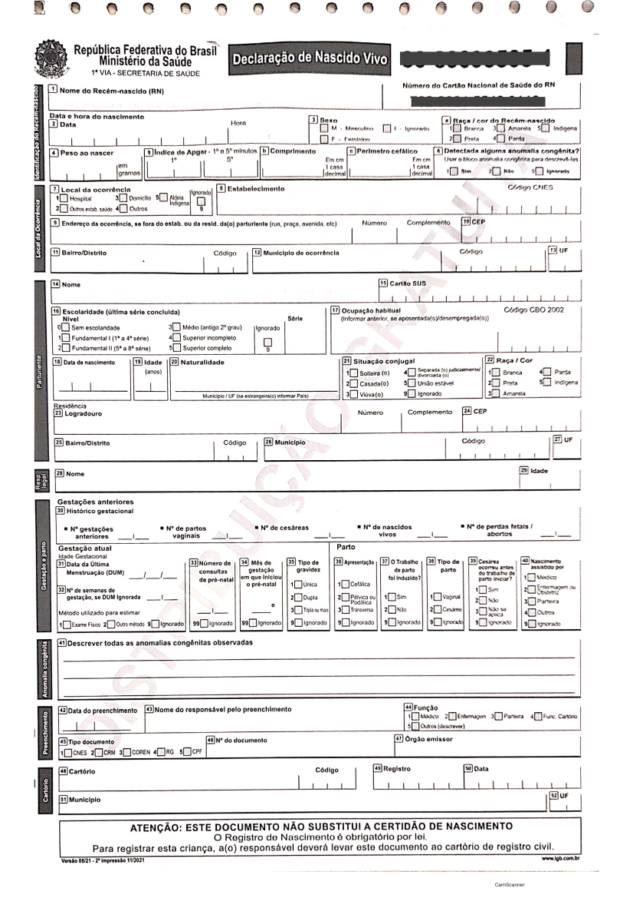

# SINASC -- Sistema de Informação sobre Nascidos Vivos {#sec-sinasc}

::: {.content-visible when-format="html"}
```{=html}
<section class="podcast-player" data-transcript="podcast/sinasc_transcript.json?v=20260712-elevenv3">
<h2>Podcast do capítulo</h2>
<p>Ouça a conversa e acompanhe a transcrição sincronizada. Áudio gerado por IA.</p>
<audio class="podcast-audio" controls preload="metadata">
  <source src="podcast/sinasc.mp3?v=20260712-elevenv3" type="audio/mpeg">
  Seu navegador não suporta o elemento de áudio.
</audio>
<details class="podcast-transcript-wrap">
<summary>Acompanhar transcrição</summary>
<div class="podcast-transcript" aria-live="polite"></div>
</details>
<noscript>
Para acompanhar a transcrição, acesse o roteiro em
<a href="podcast/sinasc.md">podcast/sinasc.md</a>.
</noscript>
<script src="podcast/sync-transcript.js"></script>
</section>
```
:::

## Resumo

::: {#qua-sinasc-caracteristicas-gerais-do-sinasc}

| Característica | Descrição |
|---|---|
| Ano de criação | 1990 |
| Evento registrado | Nascido vivo |
| Documento básico | Declaração de Nascido Vivo (DNV) |
| Unidade de análise | Declaração de Nascido Vivo |
| Cobertura | Todo o território nacional |
| Abrangência assistencial | Nascimentos ocorridos em serviços públicos, privados, suplementares, domicílios e outros locais |
| Disseminação | Em geral anual, com bases preliminares e consolidadas |

Características gerais do SINASC

:::

O Sistema de Informação sobre Nascidos Vivos (SINASC) é a principal fonte nacional para estudar nascimentos, condições da gestação, parto, recém-nascido e características maternas. Seus dados são usados para descrever o perfil dos nascidos vivos, acompanhar desigualdades, avaliar a atenção pré-natal e ao parto, construir denominadores para indicadores infantis e apoiar o planejamento da rede materno-infantil.

Como se trata de um sistema baseado em evento vital, o SINASC não acompanha a gestante durante toda a gravidez. Ele registra o desfecho nascimento vivo e reúne informações observadas ou declaradas no momento do parto e do preenchimento da Declaração de Nascido Vivo. Essa característica é uma vantagem quando a análise precisa de uma base nacional padronizada de nascimentos, mas exige cautela quando a pergunta envolve trajetória assistencial, qualidade clínica do pré-natal ou causalidade entre exposição materna e desfecho neonatal.

O quadro de resumo situa o SINASC dentro da família dos sistemas nacionais de informação em saúde: seu documento de entrada é padronizado, a unidade de análise é a DNV e a cobertura pretendida é universal. Por isso, antes de iniciar uma análise, é útil verificar se o problema realmente se refere a nascidos vivos ou se seria melhor usar outro sistema como fonte principal.

## Quando usar o SINASC

O SINASC deve ser usado quando a pergunta envolve nascidos vivos, nascimento, parto, condições ao nascer ou indicadores que dependem do número de nascidos vivos. Em muitas análises, ele funciona como fonte principal do numerador; em outras, como denominador para eventos registrados em sistemas como SIM (@sec-sim) ou SINAN (@sec-sinan) (ver @qua-sinasc-perguntas-comuns-que-podem-ser-respondidas-com-o-sinasc).

::: {#qua-sinasc-perguntas-comuns-que-podem-ser-respondidas-com-o-sinasc}

| Pergunta de análise | Usar SINASC para | Fonte complementar comum |
|---|---|---|
| Quantos nascidos vivos ocorreram? | Contar registros de DNV | Registro Civil para comparação de cobertura |
| Como está o perfil dos nascimentos? | Descrever peso, idade gestacional, tipo de parto e Apgar | CNES para caracterizar estabelecimentos |
| Como está a atenção pré-natal? | Analisar consultas, início do pré-natal e escolaridade materna | SISAB em análises de atenção primária |
| Qual o denominador da mortalidade infantil? | Contar nascidos vivos por residência | SIM para óbitos infantis |
| Há desigualdades ao nascer? | Estratificar por raça/cor, escolaridade, idade e território | POP e bases territoriais |
| Qual a frequência de anomalias congênitas? | Identificar registros na DNV | Vigilância especializada e investigação |

Perguntas comuns que podem ser respondidas com o SINASC

:::

Esse conjunto de perguntas mostra que o SINASC pode responder tanto perguntas descritivas, como a contagem de nascidos vivos, quanto perguntas analíticas, como desigualdades no peso ao nascer ou no tipo de parto. O ponto decisivo é não transformar automaticamente variáveis disponíveis em conclusões sobre qualidade da assistência. Número de consultas, tipo de parto, Apgar e anomalias congênitas, por exemplo, precisam ser lidos junto com contexto clínico, cobertura, completitude e diferenças de preenchimento entre serviços.

## Histórico e organização

O SINASC foi concebido de forma semelhante ao SIM, com documento padronizado, fluxo nacional e integração com o Registro Civil. A implantação nacional começou em 1990 e os dados consolidados passaram a estar disponíveis a partir de 1994. Nos primeiros anos, o sistema enfrentou problemas de cobertura, especialmente em áreas mais remotas e em municípios das regiões Norte e Nordeste, além de desafios de rotina de crítica, duplicidade e controle de qualidade.

Estudos de avaliação indicam melhora importante da cobertura e da qualidade do SINASC, mas também mostram heterogeneidade entre municípios e variáveis. A experiência de implantação do SIM e do SINASC é descrita como parte do esforço de construção de séries nacionais mais completas para eventos vitais, ainda que com diferenças regionais no ritmo de consolidação [@jorgeAnaliseQualidadeEstatisticas2007]. @szwarcwaldAvaliacaoInformacoesSistema2019 estimam cobertura superior a 90% na maioria das Unidades da Federação, embora municípios remotos e mais vulneráveis ainda possam apresentar cobertura insuficiente. A qualidade também varia conforme o campo analisado; idade gestacional, paridade, escolaridade materna e anomalias congênitas exigem atenção especial [@pedrazaQualidadeSistemaInformacoes2012; @luquettiQualidadeNotificacaoAnomalias2010].

Na prática, isso significa que a série histórica do SINASC não deve ser lida apenas como uma sequência de nascimentos. Ela também reflete mudanças de implantação, qualificação das rotinas municipais e estaduais, informatização, revisão de formulários e estratégias de busca ativa. Comparações temporais muito longas precisam considerar esses elementos, principalmente quando o interesse está em municípios pequenos ou em variáveis de preenchimento mais sensível.

## Fluxo da Declaração de Nascido Vivo

O documento básico do SINASC é a Declaração de Nascido Vivo (DNV), padronizada nacionalmente, gerenciada e distribuída pelo Ministério da Saúde. Assim como a DO, a DNV é emitida em três vias e distribuída gratuitamente.

O fluxo das vias da DNV explica por que o SINASC tem dupla importância: ele alimenta uma base epidemiológica e, ao mesmo tempo, conversa com o processo civil de registro do nascimento. A separação das vias cria pontos de controle distintos, mas também depende de rotinas locais bem organizadas para evitar atraso de digitação, perda de documento ou inconsistência entre campos clínicos e administrativos.

```{mermaid}
%%| fig-cap: "Fluxo de emissão e destinação das vias da Declaração de Nascido Vivo"
%%| label: fig-sinasc-dnv
flowchart TD
  parto[Parto com nascido vivo] --> dnv[Declaração de Nascido Vivo]
  dnv --> via1[1ª via]
  dnv --> via2[2ª via]
  dnv --> via3[3ª via]

  via1 --> sms[Secretaria Municipal de Saúde]
  sms --> ses[Secretaria Estadual de Saúde]
  ses --> ms[Ministério da Saúde]
  ms --> sinasc[Base nacional do SINASC]

  via2 --> fam[Família]
  fam --> rg[Registro Civil]
  rg --> cert[Certidão de Nascimento]

  via3 --> es[Estabelecimento ou prontuário]
```

A primeira via é encaminhada à secretaria municipal de saúde para processamento e alimentação do SINASC. A segunda via é entregue à família para apresentação ao Registro Civil e emissão da certidão de nascimento. A terceira via permanece no estabelecimento de saúde ou junto ao prontuário.

Esse encadeamento ajuda a interpretar problemas de oportunidade. Um nascimento pode ter ocorrido em determinada data, mas entrar na base municipal ou nacional depois, a depender do tempo de envio, digitação, crítica e consolidação. Por isso, análises de anos recentes devem explicitar se usam base preliminar ou consolidada.

## O que é nascido vivo

Um nascimento é classificado como nascido vivo quando, após a separação do corpo materno, há respiração ou qualquer outro sinal de vida, independentemente da duração da gestação ou da viabilidade clínica [@viacavaSistemaInformacaoSobre2009].

Essa definição é central para separar nascidos vivos de óbitos fetais. Se houve qualquer sinal de vida após a separação, o evento deve ser registrado como nascido vivo no SINASC; se ocorrer morte posteriormente, também haverá registro no SIM. Óbitos fetais são registrados no SIM, não no SINASC.

::: {#qua-sinasc-diferencas-praticas-entre-sinasc-e-sim-em-eventos-perinatais}

| Situação | Sistema principal | Observação |
|---|---|---|
| Nascido vivo sem óbito posterior | SINASC | Registro por DNV |
| Nascido vivo que morre após o parto | SINASC e SIM | Há DNV e Declaração de Óbito |
| Óbito neonatal | SIM | Denominador geralmente vem do SINASC |
| Óbito fetal | SIM | Não entra como nascido vivo no SINASC |
| Indicador de mortalidade infantil | SIM + SINASC | Óbitos no numerador e nascidos vivos no denominador |

Diferenças práticas entre SINASC e SIM em eventos perinatais

:::

A comparação do @qua-sinasc-diferencas-praticas-entre-sinasc-e-sim-em-eventos-perinatais destaca uma distinção operacional que evita muitos erros: nascimento vivo e óbito fetal pertencem a fluxos informacionais diferentes. Quando um recém-nascido apresenta sinal de vida e morre em seguida, o evento precisa aparecer tanto no SINASC quanto no SIM, pois há um nascimento e há um óbito. Essa dupla presença não é duplicidade; é a forma correta de representar dois eventos vitais relacionados.

## Cobertura e unidade de análise

A unidade de análise do SINASC é a DNV. Cada registro corresponde a um nascimento vivo, não a uma gestante acompanhada ao longo da gravidez. Em gestações múltiplas, cada nascido vivo deve ter sua própria DNV (ver @qua-sinasc-dimensoes-importantes-para-analise-do-sinasc).

::: {#qua-sinasc-dimensoes-importantes-para-analise-do-sinasc}

| Dimensão | Cuidado de interpretação |
|---|---|
| Residência da mãe | Usada em taxas e indicadores populacionais |
| Ocorrência do parto | Útil para analisar rede assistencial e fluxo de partos |
| Recém-nascido | Peso ao nascer, Apgar, sexo, anomalias e idade gestacional |
| Gestação e parto | Tipo de gravidez, tipo de parto, consultas e duração da gestação |
| Mãe | Idade, escolaridade, raça/cor, situação conjugal e história reprodutiva |

Dimensões importantes para análise do SINASC

:::

Para estimar riscos na população residente, em geral utiliza-se o município de residência da mãe. Para avaliar concentração de partos, serviços de referência e deslocamentos para nascer, o município de ocorrência do parto é mais informativo.

Esse recorte organiza dimensões que costumam se misturar durante a análise. Um mesmo registro contém atributos do recém-nascido, da mãe, da gestação, do parto e do local de ocorrência, mas nem todos respondem à mesma pergunta. Misturar essas dimensões pode levar, por exemplo, a calcular risco populacional com base no local de ocorrência do parto ou a interpretar perfil de maternidade como perfil das residentes do município.

## Gestações múltiplas

Em gestações múltiplas, o SINASC registra cada nascido vivo separadamente. Assim, uma gestação gemelar com dois nascidos vivos deve gerar duas DNV. Isso é adequado para indicadores cujo evento é o nascido vivo, mas exige cuidado quando a pergunta se refere à gestação, à mãe ou ao parto (ver @qua-sinasc-unidade-de-analise-em-gestacoes-multiplas).

::: {#qua-sinasc-unidade-de-analise-em-gestacoes-multiplas}

| Pergunta | Unidade adequada | Cuidado |
|---|---|---|
| Quantos nascidos vivos ocorreram? | Nascido vivo | Cada DNV conta uma vez |
| Quantas gestações terminaram em nascimento vivo? | Gestação | Gestações múltiplas não devem ser duplicadas |
| Qual o perfil das mães? | Mãe | A mesma mãe pode aparecer mais de uma vez |
| Qual o perfil dos partos? | Parto | Partos múltiplos podem gerar múltiplos registros |

Unidade de análise em gestações múltiplas

:::

Essa distinção é especialmente importante em indicadores sensíveis à gemelaridade, como baixo peso, prematuridade e tipo de parto. Se o objetivo é contar recém-nascidos, cada DNV deve permanecer como uma observação. Se o objetivo é descrever gestações ou partos, será necessário definir uma estratégia para agrupar registros relacionados, o que nem sempre é possível com dados agregados.

## Variáveis-chave

As variáveis mais usadas no SINASC podem ser organizadas em blocos analíticos. Essa organização ajuda a separar perguntas sobre perfil do recém-nascido, atenção à gestação, assistência ao parto e desigualdades sociais.

::: {#qua-sinasc-blocos-de-informacao-disponiveis-no-sinasc}

| Bloco | Exemplos de variáveis | Uso típico |
|---|---|---|
| Recém-nascido | Peso ao nascer, sexo, Apgar, anomalia congênita | Condições ao nascer e risco neonatal |
| Gestação | Idade gestacional, tipo de gravidez, consultas pré-natais | Qualidade e oportunidade do pré-natal |
| Parto | Tipo de parto, local de ocorrência, estabelecimento | Organização da assistência ao parto |
| Mãe | Idade, raça/cor, escolaridade, município de residência | Desigualdades e perfil reprodutivo |
| Registro | Data de nascimento, data de cadastro, número da DNV | Controle de duplicidade e oportunidade |

Blocos de informação disponíveis no SINASC

:::

Os blocos do @qua-sinasc-blocos-de-informacao-disponiveis-no-sinasc também ajudam a planejar a avaliação de qualidade. Variáveis administrativas, como datas e municípios, tendem a ser usadas para vinculação, recorte territorial e controle de oportunidade. Variáveis clínicas e sociodemográficas, por sua vez, costumam exigir inspeção mais cuidadosa de ignorados, categorias residuais e mudanças de preenchimento ao longo do tempo.

::: {.callout-warning}
Campos derivados de avaliação clínica, como idade gestacional, Apgar e anomalias congênitas, podem variar em completitude e validade. Antes de usá-los como desfecho ou critério de estratificação, avalie proporção de ignorados, mudanças no formulário e consistência com outras variáveis.
:::

### Transformações frequentes

Muitas análises do SINASC dependem de transformar campos originais em categorias epidemiológicas. Essas regras devem ser documentadas no método, especialmente quando há mudanças de formulário ou códigos ignorados (ver @qua-sinasc-transformacoes-comuns-em-analises-com-sinasc).

::: {#qua-sinasc-transformacoes-comuns-em-analises-com-sinasc}

| Conceito | Regra operacional comum | Campo associado |
|---|---|---|
| Baixo peso ao nascer | Peso menor que 2.500 g | `PESO` |
| Muito baixo peso | Peso menor que 1.500 g | `PESO` |
| Prematuridade | Menos de 37 semanas | `GESTACAO` |
| Mãe adolescente | Idade materna menor que 20 anos | `IDADEMAE` |
| Parto cesáreo | Tipo de parto cesáreo | `PARTO` |
| Pré-natal insuficiente | Baixo número de consultas | `CONSULTAS` |
| Anomalia congênita registrada | Presença informada na DNV | `IDANOMAL` ou equivalente |

Transformações comuns em análises com SINASC

:::

Essas transformações devem ser tratadas como decisões metodológicas, não como detalhes de programação. Dependendo do ano, do dicionário usado e do pacote de processamento, códigos ignorados podem aparecer como categorias, valores numéricos específicos ou `NA`. Uma boa prática é apresentar no método a regra usada para o numerador, o denominador e as exclusões.

## Anomalias congênitas

O SINASC permite registrar anomalias congênitas identificadas no nascimento, mas esse campo é particularmente sensível à qualidade do exame, ao treinamento da equipe, à disponibilidade de diagnóstico e ao preenchimento da DNV. Estudos mostram subnotificação relevante, o que impede interpretar baixa frequência registrada como baixa ocorrência real sem avaliação de qualidade [@luquettiQualidadeNotificacaoAnomalias2010].

Para análises de anomalias congênitas, verifique a proporção de ignorados, a mudança temporal do preenchimento, a consistência por estabelecimento e a compatibilidade entre frequência observada e padrões esperados. Quando possível, complemente a análise com vigilância específica, prontuários, investigação local ou bases especializadas.

Também é importante lembrar que nem toda anomalia é identificável no momento do nascimento. Algumas dependem de exames complementares, seguimento clínico ou confirmação diagnóstica posterior. Assim, o campo da DNV é útil para vigilância e triagem epidemiológica, mas não substitui sistemas ou estudos desenhados especificamente para monitorar malformações congênitas.

## Análise territorial e temporal

Assim como no SIM, o SINASC permite análises por residência e por ocorrência. A escolha deve seguir a pergunta de pesquisa (ver @qua-sinasc-recortes-territoriais-frequentes-no-sinasc).

::: {#qua-sinasc-recortes-territoriais-frequentes-no-sinasc}

| Recorte | Pergunta respondida | Exemplo |
|---|---|---|
| Residência da mãe | Onde vive a população que teve filhos? | Taxa bruta de natalidade por município |
| Ocorrência do parto | Onde os partos aconteceram? | Distribuição de partos por rede assistencial |
| Estabelecimento | Em que serviço ocorreu o parto? | Perfil de partos por maternidade |

Recortes territoriais frequentes no SINASC

:::

Na análise temporal, diferencie a data de nascimento, o ano do arquivo e a situação de consolidação da base. Bases preliminares são úteis para monitoramento oportuno, mas podem mudar com atualizações posteriores.

Esses recortes resumem uma escolha que deve aparecer explicitamente no plano analítico. O recorte por residência descreve a população de referência e é o mais adequado para taxas e comparações territoriais de risco. O recorte por ocorrência descreve a rede onde o parto aconteceu e é mais apropriado para estudar fluxos assistenciais, centralização de maternidades e capacidade instalada.

## Exemplo: baixo peso ao nascer

Baixo peso ao nascer é um exemplo de uso do SINASC para avaliar condições ao nascer e desigualdades materno-infantis. A definição operacional mais comum considera baixo peso quando o recém-nascido pesa menos de 2.500 g (ver @qua-sinasc-campos-uteis-em-uma-analise-de-baixo-peso-ao-nascer).

::: {#qua-sinasc-campos-uteis-em-uma-analise-de-baixo-peso-ao-nascer}

| Elemento da análise | Campo ou dimensão | Cuidado |
|---|---|---|
| Desfecho | `PESO` menor que 2.500 g | Excluir peso ignorado ou inconsistente |
| Denominador | Nascidos vivos com peso informado | Documentar exclusões |
| Território | Residência da mãe | Usar para desigualdade territorial |
| Assistência | Ocorrência ou estabelecimento | Usar para rede de parto |
| Estratificação | Idade materna, raça/cor, escolaridade | Avaliar completitude |
| Contexto clínico | Idade gestacional e tipo de gravidez | Separar prematuridade e gestação múltipla |

Campos úteis em uma análise de baixo peso ao nascer

:::

Uma análise mais consistente deve avaliar baixo peso junto com idade gestacional. Um recém-nascido pode ter baixo peso por prematuridade, restrição de crescimento intrauterino ou combinação de fatores. Em municípios pequenos, use períodos agregados ou medidas de suavização quando a proporção for instável.

Os elementos do quadro funcionam como um roteiro mínimo para evitar uma proporção aparentemente simples, mas frágil. O denominador deve excluir registros sem peso válido, a estratificação precisa considerar perdas de informação e o território deve ser coerente com a pergunta. Se o interesse for desigualdade entre residentes, use residência da mãe; se for perfil de serviços de parto, use ocorrência ou estabelecimento.

```{r}
#| eval: false
#| message: false
library(dplyr)

baixo_peso_mun <- sinasc_p |>
  filter(!is.na(PESO), PESO > 0) |>
  mutate(baixo_peso = PESO < 2500) |>
  group_by(CODMUNRES) |>
  summarise(
    nascidos_vivos = n(),
    baixo_peso = sum(baixo_peso),
    prop_baixo_peso = baixo_peso / nascidos_vivos,
    .groups = "drop"
  )

baixo_peso_mun
```

::: {.content-visible when-format="html"}
```{r}
#| echo: false
#| message: false
#| fig-cap: "Linha do tempo do SINASC"
#| column: page
timevis::timevis(readr::read_csv2(file = "linha_tempo_sinasc.csv"))
```
:::

## Modelo da Declaração de Nascido Vivo

{#modelo-dnv fig-alt="Modelo de Declaração de Nascido Vivo" width="90%"}

A imagem da DNV ajuda a perceber que o SINASC nasce de um formulário estruturado, não de um banco criado apenas para pesquisa. Campos aparentemente simples carregam instruções de preenchimento, categorias oficiais e limites do momento em que a informação é registrada. Por isso, o manual da DNV e o dicionário de dados devem ser consultados junto com a base.

## Estrutura dos dados

O documento de [estrutura do SINASC](assets/sinasc/Estrutura_SINASC_para_CD.pdf) descreve as variáveis disponíveis nos arquivos de disseminação. Entre os campos de maior uso estão data de nascimento, município de residência da mãe, município de ocorrência, idade materna, escolaridade, raça/cor, número de consultas de pré-natal, tipo de parto, idade gestacional, peso ao nascer, Apgar e presença de anomalia congênita.

Antes de produzir indicadores, vale fazer uma inspeção exploratória dos campos essenciais: número de registros por ano e território, distribuição de datas, proporção de ignorados, categorias inesperadas e valores biologicamente implausíveis. Essa etapa costuma revelar problemas que não aparecem em tabulações agregadas, como códigos residuais, mudanças de nomenclatura e campos disponíveis apenas em determinados períodos.

### Campos mínimos para inspecionar

Os nomes e a disponibilidade das variáveis podem variar conforme o ano e a forma de acesso. O @qua-sinasc-campos-uteis-para-uma-primeira-inspecao-dos-dados-do-sinasc reúne os campos que costumam orientar uma primeira inspeção.

::: {#qua-sinasc-campos-uteis-para-uma-primeira-inspecao-dos-dados-do-sinasc}

| Campo | Uso |
|---|---|
| `DTNASC` | Data de nascimento |
| `CODMUNRES` | Município de residência da mãe |
| `CODMUNNASC` ou equivalente | Município de ocorrência do nascimento |
| `IDADEMAE` | Idade materna |
| `RACACOR` ou equivalente | Raça/cor |
| `ESCMAE` ou equivalente | Escolaridade materna |
| `CONSULTAS` | Número de consultas pré-natais |
| `GESTACAO` | Idade gestacional |
| `PARTO` | Tipo de parto |
| `PESO` | Peso ao nascer |
| `APGAR1` e `APGAR5` | Vitalidade no 1o e 5o minutos |
| `IDANOMAL` ou equivalente | Presença de anomalia congênita |

Campos úteis para uma primeira inspeção dos dados do SINASC

:::

A lista não esgota o dicionário do SINASC, mas reúne campos que ajudam a confirmar se a base foi lida corretamente. Eles permitem checar volume, tempo, território, características maternas, assistência e condições ao nascer. Em análises mais específicas, outros campos podem ser necessários, como estabelecimento de ocorrência, tipo de gravidez, ocupação materna ou histórico reprodutivo.

### Prefixo dos arquivos

Nos arquivos de disseminação do DATASUS, o prefixo ajuda a reconhecer o conteúdo antes mesmo da leitura do banco. Isso é útil quando há muitos arquivos baixados localmente ou quando a análise combina diferentes sistemas (ver @qua-sinasc-prefixos-comuns-dos-arquivos-do-sinasc).

::: {#qua-sinasc-prefixos-comuns-dos-arquivos-do-sinasc}

| Prefixo | Conteúdo |
|---|---|
| DN | Declarações de nascidos vivos |
| DNEX | Declarações de nascidos vivos residentes no exterior |

Prefixos comuns dos arquivos do SINASC

:::

Em análises nacionais, registros de residentes no exterior geralmente precisam ser avaliados separadamente, pois não pertencem à população residente brasileira usada como denominador de indicadores municipais, estaduais ou nacionais. A regra de inclusão deve ser documentada para manter coerência entre numerador, denominador e território.

## Acesso aos dados

Os dados do SINASC podem ser acessados por diferentes caminhos, a depender do objetivo da análise.

::: {#qua-sinasc-formas-de-acesso-aos-dados-do-sinasc}

| Forma de acesso | Indicação de uso |
|---|---|
| TabNet | Tabulações rápidas e consultas agregadas |
| TabWin/DBC | Download e tabulação local de arquivos do DATASUS |
| R | Fluxos reprodutíveis com `{microdatasus}` |
| Python | Fluxos reprodutíveis com PySUS |
| PCDaS | Uso em ambiente de *notebooks* e infraestrutura de dados |
| OpenDataSUS | Arquivos em formatos abertos, incluindo bases preliminares |

Formas de acesso aos dados do SINASC

:::

Esse @qua-sinasc-formas-de-acesso-aos-dados-do-sinasc diferencia acesso para consulta rápida e acesso para análise reprodutível. TabNet é prático para exploração inicial e conferência de totais. Arquivos DBC, pacotes em R ou Python e bases em plataformas de dados são mais adequados quando a análise precisa documentar filtros, recodificações e versões dos dados.

### TabNet

Os dados do SINASC podem ser acessados no TabNet do DATASUS, na seção de Estatísticas Vitais.

- [TabNet SINASC](https://datasus.saude.gov.br/nascidos-vivos-desde-1994)

### TabWin e transferência de arquivos

Para uso no TabWin ou em fluxos próprios de processamento, é possível baixar arquivos de dados no formato DBC e arquivos auxiliares de tabulação no serviço de transferência de arquivos do DATASUS.

- [TabWin - Transferência de arquivos](https://datasus.saude.gov.br/transferencia-de-arquivos/)

Esse caminho é útil quando a equipe precisa manter uma cópia local dos dados ou reproduzir tabulações em ambiente sem conexão permanente. Nesse caso, registre a data do download, os arquivos utilizados e qualquer conversão de formato aplicada aos microdados.

### R

O pacote [`{microdatasus}`](https://rfsaldanha.github.io/microdatasus/index.html) permite baixar e pré-processar microdados do DATASUS em R [@Saldanha2019a].

```{r}
#| eval: false
#| message: false
library(microdatasus)

sinasc_raw <- fetch_datasus(
  year_start = 2021,
  year_end = 2021,
  uf = "AC",
  information_system = "SINASC"
)

sinasc_p <- process_sinasc(sinasc_raw)

sinasc_p
```

O exemplo ilustra um fluxo mínimo: baixar os registros, processar os códigos originais e só então iniciar a análise. Em trabalhos reprodutíveis, convém salvar a versão bruta, a versão processada e o script de transformação, para que totais e categorias possam ser auditados depois.

### Python

A biblioteca PySUS também permite acessar dados do SINASC em fluxos de análise em Python.

- [PySUS SINASC](https://pysus.readthedocs.io/en/latest/databases/SINASC.html)

### PCDaS

Os dados do SINASC estão disponíveis na Plataforma de Ciência de Dados aplicada à Saúde (PCDaS) para acesso em ambiente de *notebooks*.

- [Dados SINASC](https://pcdas.icict.fiocruz.br/conjunto-de-dados/sistema-de-informacao-sobre-nascidos-vivos/)

### OpenDataSUS

Dados em formato CSV estão sendo disponibilizados no OpenDataSUS, incluindo versões preliminares de anos recentes.

- [OpenDataSUS - SINASC](https://opendatasus.saude.gov.br/dataset/sistema-de-informacao-sobre-nascidos-vivos-sinasc)

## Relacionamento com outros sistemas

O SINASC é frequentemente combinado com outros sistemas para construir indicadores de saúde materno-infantil. A integração pode ser feita por agregação territorial e temporal ou por relacionamento de registros, quando a finalidade e a governança dos dados justificarem esse procedimento (ver @qua-sinasc-integracoes-frequentes-entre-o-sinasc-e-outros-sistemas).

::: {#qua-sinasc-integracoes-frequentes-entre-o-sinasc-e-outros-sistemas}

| Pergunta | Fontes combinadas | Cuidado principal |
|---|---|---|
| Mortalidade infantil | SINASC + SIM (@sec-sim) | Usar nascidos vivos como denominador e óbitos por idade |
| Mortalidade neonatal | SINASC + SIM | Separar óbitos neonatais precoces e tardios |
| Eventos gestacionais notificados | SINASC + SINAN (@sec-sinan) | Harmonizar identificação, datas e território |
| Partos e rede assistencial | SINASC + CNES (@sec-cnes) | Relacionar estabelecimento e tipo de serviço |
| Indicadores populacionais | SINASC + POP (@sec-pop) | Usar população residente compatível com o período |

Integrações frequentes entre o SINASC e outros sistemas

:::

Em relacionamentos determinísticos ou probabilísticos, defina previamente a unidade final de análise. Ao relacionar SINASC e SIM, por exemplo, a unidade pode ser o nascimento, o óbito infantil ou o par nascimento-óbito, dependendo da pergunta.

As integrações listadas são comuns, mas cada combinação muda a interpretação. Quando a análise é agregada por município e ano, o resultado descreve associações territoriais. Quando há relacionamento de registros, o resultado pode se aproximar de trajetórias individuais, mas passa a depender de regras de pareamento, qualidade dos identificadores, proteção de dados e avaliação de pares falsos ou perdidos.

## Uso como denominador

O SINASC é frequentemente usado como denominador porque registra a população de nascidos vivos exposta a eventos no primeiro ano de vida ou em períodos próximos ao nascimento. O ponto principal é garantir que numerador e denominador usem o mesmo recorte territorial, temporal e populacional (ver @qua-sinasc-uso-do-sinasc-como-denominador-em-indicadores).

::: {#qua-sinasc-uso-do-sinasc-como-denominador-em-indicadores}

| Indicador | Numerador | Denominador no SINASC |
|---|---|---|
| Mortalidade infantil | Óbitos menores de 1 ano no SIM | Nascidos vivos |
| Mortalidade neonatal | Óbitos de 0 a 27 dias no SIM | Nascidos vivos |
| Mortalidade neonatal precoce | Óbitos de 0 a 6 dias no SIM | Nascidos vivos |
| Mortalidade pós-neonatal | Óbitos de 28 a 364 dias no SIM | Nascidos vivos |
| Razão de mortalidade materna | Óbitos maternos no SIM | Nascidos vivos |

Uso do SINASC como denominador em indicadores

:::

Quando o indicador é uma proporção entre nascidos vivos, como baixo peso ao nascer ou parto cesáreo, o SINASC fornece numerador e denominador. Quando o indicador envolve óbitos, o numerador vem do SIM e o denominador costuma vir do SINASC.

Os indicadores do quadro têm em comum a necessidade de compatibilizar tempo e território. Para mortalidade infantil, por exemplo, o denominador costuma ser o conjunto de nascidos vivos de mães residentes em determinado local e ano, enquanto o numerador vem dos óbitos de crianças com a mesma base territorial. Diferenças entre residência e ocorrência podem produzir taxas distorcidas, sobretudo em municípios que concentram maternidades ou serviços de referência.

## Principais usos e indicadores

Segundo @OPAS2008, os dados do SINASC são utilizados na construção de indicadores demográficos, reprodutivos e materno-infantis. A ficha de cada indicador deve explicitar numerador, denominador, período, território, faixa etária materna e critérios de inclusão (ver @qua-sinasc-exemplos-de-indicadores-construidos-com-dados-do-sinasc).

::: {#qua-sinasc-exemplos-de-indicadores-construidos-com-dados-do-sinasc}

| Indicador | Numerador principal | Denominador ou cuidado |
|---|---|---|
| Taxa bruta de natalidade | Nascidos vivos | População residente |
| Taxa específica de fecundidade | Nascidos vivos por idade materna | Mulheres da mesma faixa etária |
| Proporção de baixo peso ao nascer | Nascidos vivos com peso menor que 2.500 g | Nascidos vivos com peso informado |
| Proporção de prematuridade | Nascidos vivos pré-termo | Verificar qualidade da idade gestacional |
| Proporção de parto cesáreo | Nascidos vivos por cesariana | Interpretar segundo tipo de serviço e risco |
| Cobertura de pré-natal | Nascidos vivos por número de consultas | Observar mudanças de formulário e ignorados |
| Mortalidade infantil | Óbitos menores de 1 ano no SIM | Nascidos vivos do SINASC |

Exemplos de indicadores construídos com dados do SINASC

:::

Consulte o [livro da RIPSA](http://tabnet.datasus.gov.br/tabdata/livroidb/2ed/indicadores.pdf) para mais detalhes sobre esses e outros indicadores.

O conjunto de indicadores reúne medidas de naturezas diferentes. Alguns medem volume ou fecundidade e exigem população como denominador; outros medem proporções entre nascidos vivos; e outros combinam SINASC e SIM. Separar esses grupos evita confundir taxa, proporção e razão, além de facilitar a escrita da ficha técnica de cada indicador.

## Cuidados de interpretação

Ao utilizar o SINASC, alguns cuidados são recorrentes:

- Verificar se a unidade de análise é nascido vivo, parto, gestação ou mãe;
- Distinguir município de residência da mãe e município de ocorrência do parto;
- Verificar cobertura antes de comparar municípios pequenos ou áreas remotas;
- Avaliar completitude e consistência de idade gestacional, peso, Apgar, raça/cor, escolaridade e anomalias congênitas;
- Separar nascidos vivos de óbitos fetais;
- Considerar mudanças no formulário, nas regras de preenchimento e na consolidação das bases;
- Evitar interpretar número de consultas pré-natais sem considerar idade gestacional e acesso aos serviços;
- Avaliar duplicidades, especialmente quando a análise usa microdados.

::: {#qua-sinasc-checklist-de-qualidade-para-analises-com-sinasc}

| Checagem | Por que importa |
|---|---|
| Cobertura por território | Evita comparar municípios com captação desigual |
| Duplicidades | Impede superestimação de nascidos vivos |
| Peso e idade gestacional | Identifica valores incompatíveis |
| Ignorados por variável | Mede perda de informação |
| Residência e ocorrência | Define corretamente risco e oferta |
| Parto único ou múltiplo | Afeta peso, prematuridade e unidade de análise |
| Base preliminar ou consolidada | Evita que atualizações pareçam tendência |

Checklist de qualidade para análises com SINASC

:::

O checklist do @qua-sinasc-checklist-de-qualidade-para-analises-com-sinasc funciona como uma etapa de controle antes da interpretação substantiva. Ele não precisa ser apresentado integralmente em todos os relatórios, mas as decisões tomadas a partir dele devem aparecer no método: critérios de exclusão, tratamento de ignorados, escolha territorial, período usado e versão da base. Em séries municipais, também é recomendável observar flutuações abruptas que possam refletir atraso de registro ou mudança administrativa, e não alteração real do evento.

::: {.callout-warning}
Erros comuns incluem calcular taxas por ocorrência com população residente, usar nascidos vivos como proxy de gestantes, comparar prematuridade sem avaliar mudanças na mensuração da idade gestacional e interpretar baixa frequência de anomalias congênitas como ausência do problema sem verificar subnotificação.
:::

## Bibliografia recomendada

### Documentos auxiliares

- [Estrutura do SINASC](assets/sinasc/Estrutura_SINASC_para_CD.pdf)
- [Manual de preenchimento da Declaração de Nascido Vivo](assets/sinasc/declaracao-nascido-vivo-manual-instrucoes-preenchimento.pdf)

### Vídeos



### Avaliação da qualidade dos dados

- Artigo *Avaliação das informações do Sistema de Informações sobre Nascidos Vivos (SINASC), Brasil* [@szwarcwaldAvaliacaoInformacoesSistema2019]. Disponível [aqui](https://doi.org/10.1590/0102-311X00214918).
- Artigo *Qualidade do Sistema de Informações sobre Nascidos Vivos (Sinasc): análise crítica da literatura* [@pedrazaQualidadeSistemaInformacoes2012]. Disponível [aqui](https://doi.org/10.1590/S1413-81232012001000021).
- Artigo *Qualidade da notificação de anomalias congênitas pelo Sistema de Informações sobre Nascidos Vivos (SINASC): estudo comparativo nos anos 2004 e 2007* [@luquettiQualidadeNotificacaoAnomalias2010]. Disponível [aqui](https://doi.org/10.1590/S0102-311X2010000900009).
- Artigo *Análise da qualidade das estatísticas vitais brasileiras: a experiência de implantação do SIM e do SINASC* [@jorgeAnaliseQualidadeEstatisticas2007]. Disponível [aqui](https://doi.org/10.1590/S1413-81232007000300014).


<!-- BEGIN GENERATED SEE ALSO -->
::: {.content-hidden when-format="typst"}
## Veja também {#sec-veja-tambem-sinasc}

- [Eventos de saúde — seção “Nascimentos”](eventos.html#nascimentos). Na edição impressa, p. 52.

- [SIM — Sistema de Informação sobre Mortalidade — seção “Exemplo: mortalidade infantil”](sim.html#exemplo-mortalidade-infantil). Na edição impressa, p. 74.

- [CID — Classificação Internacional de Doenças — seção “CID nos sistemas brasileiros”](cid.html#cid-nos-sistemas-brasileiros). Na edição impressa, p. 401.

:::
<!-- END GENERATED SEE ALSO -->
